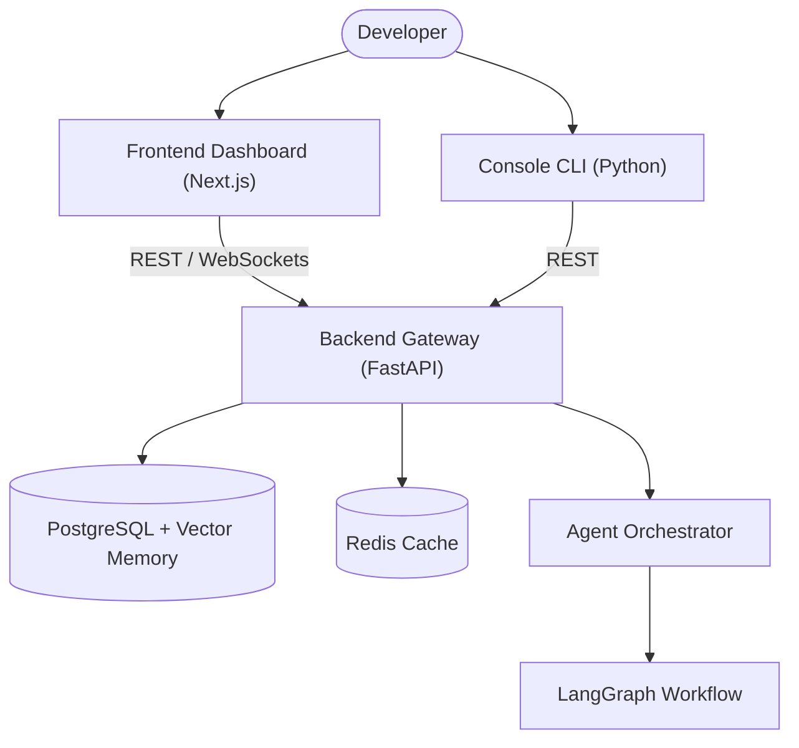

# AgentForge

> **AI-Powered Development Operating System**
>
> Build software using a coordinated team of AI agents with BYOK credentials, local repository intelligence, validation pipelines, and GitHub-native workflows.

---

## Quick Navigation

* [Overview](#overview)
* [Features & Status](#features--status)
* [Monorepo Structure](#monorepo-structure)
* [Getting Started](#getting-started)
* [Architecture](#architecture)
* [Workflow Examples](#workflow-examples)
* [Troubleshooting](#troubleshooting)
* [Documentation Directory](#documentation-directory)

---

## Overview

AgentForge is an open-source multi-agent orchestration platform designed to automate complex software engineering tasks. By employing a LangGraph workflow engine, it coordinates a specialized team of AI agents—Team Lead, Planner, Architect, Builder, Tester, Reviewer, and Deployment—to plan, generate, test, review, and deploy code changes directly in your repository.

---

## Features & Status

| Feature | Description | Status |
|:---|:---|:---:|
| **BYOK (Bring Your Own Key)** | Resolves user-level, project-level, or system-level LLM credentials dynamically. | ✅ Active |
| **GitHub App Integration** | Synchronizes code branches and publishes reviews directly as PR comments. | ✅ Active |
| **Local Sandbox Execution** | Executes generated test suites within secure runtime containers. | ✅ Active |
| **pgvector Memory Store** | Recalls long-term decisions and style patterns via vector embeddings. | ✅ Active |
| **Tree-Sitter Intelligence** | Indexes codebase symbols, dependency graphs, and call scopes. | 🚧 In Progress |
| **Enterprise SSO** | Role-based authentication and team identity single sign-on. | 📋 Planned |

---

## Monorepo Structure

```text
AgentForge/
│
├── apps/
│   ├── api/             # FastAPI backend engine, database pools, agent graph
│   ├── web/             # Next.js 15 dashboard client & visual task execution
│   └── cli/             # Developer Click console client (`agentforge` script)
│
├── app/                 # Shared core packages imported by graph nodes
│   ├── evidence_gate/   # Validation checkpoints & criteria checks
│   ├── repository_intelligence/ # Tree-sitter parsing utilities
│   └── validation/      # Pydantic schemas and sanitizers
│
├── docs/                # Comprehensive documentation vault
├── scripts/             # Developer automation scripts
├── tests/               # Global test workspace
├── README.md            # Root entry point
├── CONTRIBUTING.md      # Developer contribution code standards
├── SECURITY.md          # Security disclosure runbooks
├── LICENSE              # License agreement
└── TERMS_OF_USE.md      # Legal and usage terms
```

---

## Getting Started

### Prerequisites
* Python 3.10+
* Node.js 18+ (pnpm preferred)
* PostgreSQL with `pgvector` extension
* Redis server

### Quick Setup

1. **Clone the repository:**
   ```bash
   git clone https://github.com/your-org/AgentForge.git
   cd AgentForge
   ```

2. **Start backend services (using Docker):**
   ```bash
   docker-compose up -d
   ```

3. **Install and run the Backend API:**
   ```bash
   cd apps/api
   pip install -r requirements.txt
   cp .env.example .env  # Configure your database and provider keys
   python -m uvicorn app.main:app --reload
   ```

4. **Install and run the Frontend Dashboard:**
   ```bash
   cd ../web
   pnpm install
   pnpm dev
   ```

5. **Install the CLI Client:**
   ```bash
   cd ../cli
   pip install --editable .
   agentforge --help
   ```

---

## Architecture

AgentForge utilizes a hub-and-spoke agent workflow. The Next.js dashboard streams execution events from the backend LangGraph engine:



---

## Workflow Examples

### 1. Ad-Hoc File Review (via CLI)
Submit a code file directly to the review agent pipeline:
```bash
agentforge login
agentforge review main.py
```
This hits the `POST /api/v1/review` endpoint, trigger-routing the code through the builder and reviewer nodes to locate security holes, performance flaws, and style violations.

### 2. Multi-Agent Team Execution (via Dashboard)
1. Navigate to **Teams** and create a team with defined model agents (e.g., Lead: Claude 3.5 Sonnet, Builder: GPT-4o, Tester: Llama-3.2).
2. Create a new **Task** describing the implementation goal (e.g., "Add JWT middleware").
3. Click **Execute**. The orchestrator will fetch project files, query vector memory, and stream the graph execution (Lead Plan → Builder → Reviewer/Tester/Security parallel → Aggregator → Deliver) visually to your dashboard.

---

## Troubleshooting

### Database Migration Failures
If database startup fails, check that the `pgvector` extension is installed. You can manually check or create it:
```sql
CREATE EXTENSION IF NOT EXISTS vector;
```

### LLM Authorization Errors
AgentForge uses user-scoped BYOK settings. Ensure your keys are correctly configured on your Dashboard settings profile or that `.env` contains:
```env
OPENAI_API_KEY=your-key
ANTHROPIC_API_KEY=your-key
```

---

## Related Documentation

* **[Onboarding Guide](file:///c:/Users/garvi/AgentForge/docs/getting-started/ONBOARDING.md)**
* **[System Setup](file:///c:/Users/garvi/AgentForge/docs/getting-started/SETUP.md)**
* **[System Architecture](file:///c:/Users/garvi/AgentForge/docs/architecture/SYSTEM_ARCHITECTURE.md)**
* **[Agent Workflow Specification](file:///c:/Users/garvi/AgentForge/docs/agents/AGENT_SYSTEM.md)**
* **[API Reference](file:///c:/Users/garvi/AgentForge/docs/api/API_REFERENCE.md)**
* **[GitHub App Integration Guide](file:///c:/Users/garvi/AgentForge/docs/integrations/GITHUB.md)**