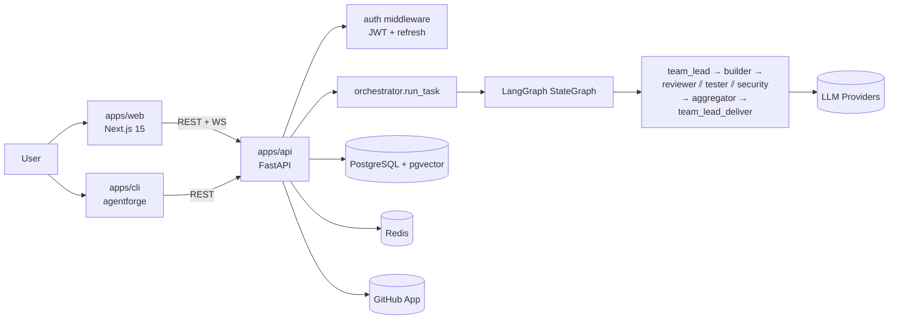

# AgentForge

> **AI-powered multi-agent orchestration for engineering teams.**
> Replace the single-AI coding assistant with a fully collaborative AI
> engineering team — Team Lead, Backend, Frontend, QA, Security, DevOps — that
> plans, builds, reviews, and ships code together.

[](#)
[](#)
[](#)

---

## Overview

AgentForge turns one prompt into one feature, end-to-end. A user submits a task
(or pushes a PR); a configurable team of AI agents collaborates through a
LangGraph workflow to plan the work, write code, run reviews, and ship a
deliverable. Every step is streamed to the UI, persisted to PostgreSQL, and
remembered in long-term memory for next time.

The project ships as three deployable units:

| App | Path | Stack |
|-----|------|-------|
| API | [`apps/api`](./apps/api/README.md) | FastAPI · LangGraph · asyncpg · Redis |
| Web | [`apps/web`](./apps/web/README.md) | Next.js 15 · React 19 · Tailwind v4 |
| CLI | [`apps/cli`](./apps/cli/README.md) | Python · httpx · JSON-only |

---

## Core Features

- 🤖 **Multi-agent teams** — Define teams of specialized agents (Team Lead,
  Builder, Reviewer, Security, Tester, Architect) with per-role model selection.
- 🔁 **LangGraph workflows** — Directed graphs with explicit handoffs, parallel
  review fan-out, and an aggregator that reconciles findings.
- 📡 **Real-time streaming** — Each node update is streamed to the UI and
  persisted to `executions.graph_state` for resumability.
- 🧠 **Long-term memory** — pgvector-backed semantic memory that surfaces
  relevant past plans, code, and reviews for every new task.
- 🔒 **Secure by default** — JWT + refresh tokens, bcrypt passwords, prompt
  injection sanitization, GitHub webhook HMAC verification, rate limiting,
  brute-force lockouts.
- ⚡ **Fast demo mode** — Optimized configuration that completes a typical task
  in under 60 seconds for live demos.
- 🔌 **Integrations** — GitHub App for PR review comments; pluggable LLM
  providers (OpenAI, Anthropic, Gemini, Ollama).
- 📊 **Benchmarks & Evals** — First-class benchmark runner and adversarial eval
  harness for measuring agent quality over time.
- 🖥️ **CLI + pre-commit** — Run reviews from the terminal or wire them into CI.

---

## Architecture Diagram



For the full breakdown, see [`docs/architecture/SYSTEM_ARCHITECTURE.md`](./docs/architecture/SYSTEM_ARCHITECTURE.md).

---

## Tech Stack

| Layer | Technology |
|-------|------------|
| Frontend | Next.js 15 (App Router), React 19, TypeScript, Tailwind v4, Radix UI, Framer Motion |
| Backend | FastAPI, Python 3.11+, Pydantic v2 |
| Agent runtime | LangGraph, Jinja2 (prompts) |
| LLM providers | OpenAI, Anthropic, Google Generative AI, Ollama (local) |
| Database | PostgreSQL 16 + pgvector (via asyncpg) |
| Cache / Rate-limit | Redis (in-memory fallback) |
| Auth | JWT (HS256) + refresh tokens, bcrypt password hashing |
| CLI packaging | pyproject.toml, console-script entry point |
| CI/CD | GitHub Actions, Docker, Docker Compose |
| Monorepo | pnpm workspaces + Turborepo |

---

## Repository Structure

```
AgentForge/
├── apps/
│   ├── api/               # FastAPI backend (agents, routes, migrations)
│   ├── web/               # Next.js 15 frontend
│   └── cli/               # Python CLI: agentforge
├── docs/
│   ├── architecture/      # SYSTEM_ARCHITECTURE, schema, prompts, agent roles
│   ├── api/               # REST + WebSocket reference
│   ├── development/       # Onboarding, conventions, env, testing, ADRs
│   ├── deployment/        # Deploy + ops
│   ├── security/          # Security model + incident runbook + privacy
│   ├── product/           # PRD, roadmap, pricing
│   ├── README.md          # Docs index
│   ├── CHANGELOG.md
│   ├── DOCUMENTATION_INDEX.md
│   └── TERMS_OF_USE.md
├── archive/               # Historical artifacts (no longer maintained)
├── .github/workflows/     # CI definitions
├── Dockerfile             # API container image
├── docker-compose.yml     # Local Postgres stack
├── Makefile               # Convenience targets
├── pyproject.toml         # Root Python config
├── package.json           # Root Node config
├── pnpm-workspace.yaml
├── turbo.json
└── README.md              # You are here
```

---

## Getting Started

### Prerequisites

- Python 3.11+
- Node.js 22+
- pnpm 9+
- Docker (for Postgres / Redis)
- Git

### Clone

```bash
git clone https://github.com/agentforge/agentforge.git
cd agentforge
```

### Configure

```bash
cp apps/api/.env.example apps/api/.env
```

Generate required secrets:

```bash
python -c "import secrets; print('AGENTFORGE_JWT_SECRET=' + secrets.token_urlsafe(32))"
python -c "import secrets; print('AGENTFORGE_JWT_REFRESH_SECRET=' + secrets.token_urlsafe(32))"
python -c "import base64, os; print('AGENTFORGE_ENCRYPTION_KEY=' + base64.b64encode(os.urandom(32)).decode())"
```

Set those values in `apps/api/.env`. See `docs/development/ENV.md` for the full
reference.

---

## Local Development

```bash
# 1. Boot infrastructure
docker compose up -d

# 2. Install Python dependencies
cd apps/api && pip install -r requirements.txt && cd ../..

# 3. Install Node dependencies (web)
pnpm install

# 4. Run the API (auto-applies migrations on startup)
make dev
#   or: cd apps/api && uvicorn app.main:app --reload --port 8000

# 5. In another terminal, run the web app
pnpm dev:web
#   web → http://localhost:3000
#   api → http://localhost:8000/docs
```

---

## Environment Variables

The single source of truth is [`apps/api/.env.example`](./apps/api/.env.example)
plus the annotated reference at
[`docs/development/ENV.md`](./docs/development/ENV.md).

Most important variables:

| Variable | Purpose |
|----------|---------|
| `AGENTFORGE_DATABASE_URL` | Postgres connection string |
| `AGENTFORGE_JWT_SECRET` | HS256 signing secret (>=16 chars) |
| `AGENTFORGE_JWT_REFRESH_SECRET` | Distinct refresh-secret (>=16 chars) |
| `AGENTFORGE_ENCRYPTION_KEY` | 32-byte base64 key for at-rest encryption |
| `AGENTFORGE_FAST_DEMO_MODE` | When `true`, single-pass graph + tight timeouts |
| `AGENTFORGE_GITHUB_APP_ID` / `_PRIVATE_KEY` / `_WEBHOOK_SECRET` | PR review bot |

---

## Running the API

```bash
cd apps/api
uvicorn app.main:app --reload --port 8000
```

- OpenAPI: http://localhost:8000/docs
- Health: `GET /api/v1/health`
- Prometheus metrics: `GET /api/v1/metrics`

---

## Running the Web

```bash
cd apps/web
pnpm dev    # → http://localhost:3000
```

---

## Running the CLI

```bash
cd apps/cli
pip install -e .
agentforge --help
agentforge login --email you@example.com
agentforge review path/to/file.py
```

The CLI stores credentials in `~/.agentforge/config.json` (mode `0600`) and
auto-refreshes access tokens on expiry.

---

## Testing

```bash
# Backend
make test
#   or: cd apps/api && pytest -v

# Frontend type-check
make typecheck

# Lint + format
make lint
make format

# Pre-commit hooks
make pre-commit-install
make pre-commit
```

---

## Benchmarking

```bash
# Full benchmark run
make benchmark

# Mock-data benchmark (no LLM costs)
make benchmark-mock

# Load test
make benchmark-load
```

Benchmarks live in `apps/api/benchmarks/`. Outputs are written to
`benchmark_results.json` by default.

---

## Evaluation Framework

```bash
make eval
```

The eval harness (`apps/api/evals/`) runs adversarial cases against the agent
graph and scores outputs against defined criteria. Use it to track regressions
when changing prompts or models.

---

## GitHub Integration

AgentForge includes a GitHub App that comments on PRs with multi-agent reviews.

1. Create a GitHub App and download the private key.
2. Set `AGENTFORGE_GITHUB_APP_ID`, `AGENTFORGE_GITHUB_APP_PRIVATE_KEY`, and
   `AGENTFORGE_GITHUB_WEBHOOK_SECRET`.
3. Configure the webhook to point at `POST /api/v1/github/webhook`.
4. Verify the webhook secret matches the HMAC header.

Implementation: `apps/api/app/integrations/github.py` and
`apps/api/app/routes/github.py`.

---

## Security

See [`docs/security/SECURITY_MODEL.md`](./docs/security/SECURITY_MODEL.md) for
the full threat model.

Highlights:

- JWT access tokens (short-lived) + refresh tokens (rotated).
- bcrypt password hashing (cost factor 12).
- Per-IP and per-route rate limiting; brute-force lockouts on auth endpoints.
- Prompt-injection sanitization (`agents/sanitize.py`) on every user-supplied
  payload that reaches an agent.
- GitHub webhooks HMAC-verified.
- Strict security headers (`X-Content-Type-Options`, `X-Frame-Options`, HSTS).
- Per-tenant isolation on every query that touches user data.

Report vulnerabilities: see [`docs/security/SECURITY.md`](./docs/security/SECURITY.md).

---

## Documentation Index

Start with [`docs/README.md`](./docs/README.md) or the curated reading order in
[`docs/DOCUMENTATION_INDEX.md`](./docs/DOCUMENTATION_INDEX.md).

| Audience | Start Here |
|----------|------------|
| New contributor | [`docs/development/ONBOARDING.md`](./docs/development/ONBOARDING.md) |
| Engineer integrating | [`docs/api/API.md`](./docs/api/API.md) |
| Operator deploying | [`docs/deployment/DEPLOYMENT.md`](./docs/deployment/DEPLOYMENT.md) |
| Security reviewer | [`docs/security/SECURITY_MODEL.md`](./docs/security/SECURITY_MODEL.md) |
| Product/GTM | [`docs/product/PRD.md`](./docs/product/PRD.md) |
| Architect | [`docs/architecture/SYSTEM_ARCHITECTURE.md`](./docs/architecture/SYSTEM_ARCHITECTURE.md) |

---

## Roadmap

See [`docs/product/ROADMAP.md`](./docs/product/ROADMAP.md).

Near-term focus: production hardening, expanded provider coverage, richer
eval suite, and team-of-teams orchestration.

---

## Contributing

We welcome PRs. Start with
[`docs/development/CONTRIBUTING.md`](./docs/development/CONTRIBUTING.md) and
follow the conventions in
[`docs/development/CONVENTIONS.md`](./docs/development/CONVENTIONS.md).

For larger changes, open an issue first to align on approach.

---

## License

MIT — see [`docs/TERMS_OF_USE.md`](./docs/TERMS_OF_USE.md) for usage terms and
the top-level LICENSE file (TBD) for the full text.

---

## Screenshots & Demo

<!-- Add screenshots once the marketing site is live. -->

_Screenshots placeholder._

_Demo placeholder — record a 2-minute walkthrough once the Quick Review flow
is ready for public viewing._