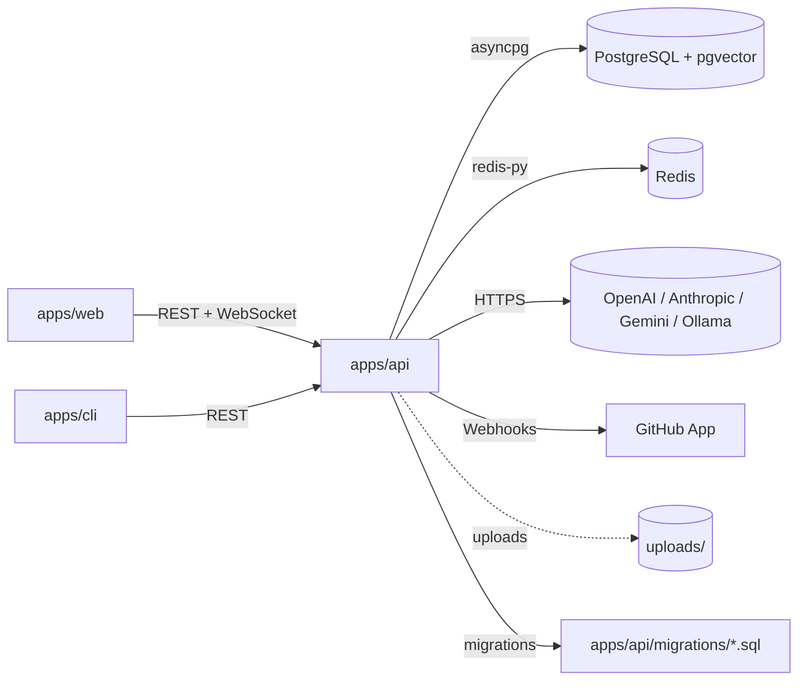

# Repository Map

A complete top-down inventory of the AgentForge codebase: every major folder,
its purpose, and how the pieces fit together.

---

## Repository Overview

| Attribute | Value |
|-----------|-------|
| Project | AgentForge |
| Description | AI-powered multi-agent orchestration platform for engineering teams |
| License | MIT |
| Primary Languages | Python (backend), TypeScript (frontend), Bash/Docker (infra) |
| Monorepo Tooling | pnpm workspaces, Turborepo |
| Status | v0.1 — under active development |

---

## Top-Level Layout

```
AgentForge/
├── apps/              # Deployable applications (api, web, cli)
├── docs/              # All active documentation
├── archive/           # Historical / non-maintained artifacts
├── .github/           # GitHub Actions CI workflows
├── Dockerfile         # API container image
├── docker-compose.yml # Local Postgres stack
├── Makefile           # Common dev/test/bench tasks
├── package.json       # Workspace root
├── pyproject.toml     # Root Python tool config
├── turbo.json         # Turborepo pipeline config
├── tsconfig.json      # Root TS config (web extends this)
├── pnpm-workspace.yaml
└── pnpm-lock.yaml
```

---

## `apps/` — Deployable Applications

### `apps/api` — FastAPI Backend

| Path | Purpose |
|------|---------|
| `app/main.py` | FastAPI entrypoint: middleware, lifespan, router registration |
| `app/auth.py` | JWT auth middleware + helper |
| `app/feedback_service.py` | User-feedback-driven pattern rejection (quality flywheel) |
| `app/file_parser.py` | Multi-language code parser used for repo context ingestion |
| `app/memory_service.py` | pgvector-backed long-term memory service |
| `app/integrations/` | External integrations (currently: GitHub App) |
| `app/routes/` | FastAPI routers (`auth`, `tasks`, `executions`, `review`, `projects`, `context`, `analytics`, `memories`, `feedback`, `github`, `teams`, `keys`, `health`) |
| `agents/graph.py` | LangGraph `StateGraph` definition |
| `agents/orchestrator.py` | Task execution driver: context, memory, graph streaming |
| `agents/state.py` | Typed shape of the agent state |
| `agents/sanitize.py` | Input sanitization (prompt-injection defenses) |
| `agents/utils.py` | Shared utilities (timeouts, retry helpers) |
| `agents/nodes/` | One file per LangGraph node (`team_lead_node.py`, `builder_node.py`, `reviewer_node.py`, `security_node.py`, `tester_node.py`, `architect_node.py`, `aggregator_node.py`) |
| `agents/prompts/` | Jinja2 system prompts, one per node + quick-review variants |
| `core/config.py` | Pydantic-settings configuration |
| `core/database.py` | `asyncpg` connection pool + migration runner |
| `core/redis.py` | Redis client + rate-limit helper |
| `core/providers.py` | Unified LLM provider abstraction (OpenAI, Anthropic, Google, Ollama) |
| `core/model_registry.py` | Capability-aware model lookup |
| `core/encryption.py` | At-rest encryption helpers |
| `core/logging_config.py` | Structured JSON / text logging |
| `core/observability.py` | Prometheus metrics + correlation IDs |
| `core/task_tracker.py` | Background task lifecycle |
| `core/validation.py` | Shared Pydantic validators |
| `models/schemas.py` | API request/response schemas |
| `models/agent_outputs.py` | Pydantic models for parsed agent output |
| `migrations/` | SQL migrations (`001_initial.sql` … `017_github_integration.sql`) |
| `benchmarks/` | Benchmark suite (runner, scorer, report) |
| `evals/` | Eval harness + adversarial cases |
| `tests/` | pytest suite (unit, integration, security, e2e) |
| `uploads/` | User-uploaded project files (runtime artifact) |

### `apps/web` — Next.js 15 Frontend

| Path | Purpose |
|------|---------|
| `app/` | Next.js App Router pages: `dashboard`, `demo`, `tasks`, `teams`, `projects`, `executions`, `analytics`, `review`, `templates`, `settings`, `login`, `register`, `benchmark` |
| `components/` | React components: agent visualizations (`agent-network`, `execution-graph`, `memory-viewer`, `context-viewer`), UI primitives (`ui/`), shared widgets |
| `components/ui/` | shadcn-style primitive components |
| `components/auth/` | Auth context provider |
| `lib/api.ts` | Typed API client with auto-refresh on 401 |
| `lib/types.ts` | Frontend↔backend type definitions |
| `lib/constants.ts`, `lib/templates.ts`, `lib/demo-data.ts` | Static data + UI constants |
| `lib/utils.ts` | `cn()` and other shared helpers |
| `next.config.ts`, `tsconfig.json` | Next.js + TS config |
| `public/` | Static assets |
| `tailwindcss v4` + `framer-motion` + `radix-ui` | Styling/animation stack |

### `apps/cli` — Python CLI

| Path | Purpose |
|------|---------|
| `agentforge_cli/__init__.py` | Package marker |
| `agentforge_cli/__main__.py` | `python -m agentforge_cli` entrypoint |
| `agentforge_cli/client.py` | HTTP client for the API |
| `tests/test_cli.py` | CLI tests |
| `pyproject.toml` | Packaging (produces `agentforge` console script) |

Commands: `agentforge login`, `agentforge review <file>`, `agentforge task …`, `agentforge status`, `agentforge logout`.

---

## `docs/` — Active Documentation

| Path | Audience |
|------|----------|
| `docs/README.md` | First-stop overview of the docs tree |
| `docs/PRD.md` | Product requirements and vision |
| `docs/TECH_SPEC.md` | Technical specification |
| `docs/SCHEMA.md` | Database schema and ER diagram |
| `docs/architecture/SYSTEM_ARCHITECTURE.md` | Frontend/backend/agent architecture (Mermaid) |
| `docs/api/API.md` | REST + WebSocket reference |
| `docs/development/ONBOARDING.md` | New-developer onboarding |
| `docs/development/TESTING.md`, `docs/development/DX.md`, `docs/development/CONVENTIONS.md` | Engineering workflow |
| `docs/deployment/DEPLOYMENT.md` | CI/CD + production |
| `docs/security/SECURITY_MODEL.md` | Threat model, auth, injection defenses |
| `docs/security/SECURITY.md`, `docs/security/INCIDENT_RUNBOOK.md` | Ops-facing security material |
| `docs/product/ROADMAP.md`, `docs/product/PRICING.md`, `docs/product/PMF_EXECUTION_PLAN.md` | Product strategy |
| `docs/DOCUMENTATION_INDEX.md` | Master index with status + recommended reading order |

---

## `archive/` — Non-Maintained Artifacts

See `archive/README.md`. Includes historical strategic reports, audit outputs,
and ad-hoc debug scripts.

---

## `.github/` — CI/CD

GitHub Actions workflows at `.github/workflows/`. Build matrix and required
checks.

---

## Dependency Relationships



- `apps/web` and `apps/cli` are independent clients of `apps/api`.
- `apps/api` is the only component that talks to PostgreSQL, Redis, and LLM providers.
- All external provider credentials are loaded via `core/config.py` from env vars.

---

## Critical Execution Flows

### 1. Quick Review (ad-hoc file review)

```
User uploads file
  → POST /api/v1/review
  → review.py routes via Builder → Reviewer LangGraph subgraph
  → streamed back as JSON; CLI returns non-zero exit on critical/high
```

### 2. Team Task (multi-agent plan → build → review → deliver)

```
POST /api/v1/tasks
  → tasks.py inserts task + execution rows
  → orchestrator.run_task() loads team_config, repo context, memories
  → graph.astream():
        team_lead_plan → builder → [reviewer, tester, security] (parallel)
        → aggregator → team_lead_deliver
  → each node update persisted to executions.graph_state + task_messages
  → memories stored; task marked completed
```

### 3. GitHub App PR Review

```
GitHub webhook → /api/v1/github/webhook
  → HMAC signature verified
  → enqueue review
  → reuse the same builder/reviewer nodes
  → post PR comment via GitHub API
```

### 4. Memory Retrieval (RAG)

```
orchestrator → memory_service.get_relevant_memories()
  → pgvector cosine similarity
  → top-k returned and injected into the team_lead prompt
```

---

## Database Migration Sequence

Migrations are applied alphabetically on startup (`pool.run_migrations()`).
Current sequence: `001_initial` → `017_github_integration`.

Adding a table or column? Add a new numbered SQL file; do not edit applied
migrations.