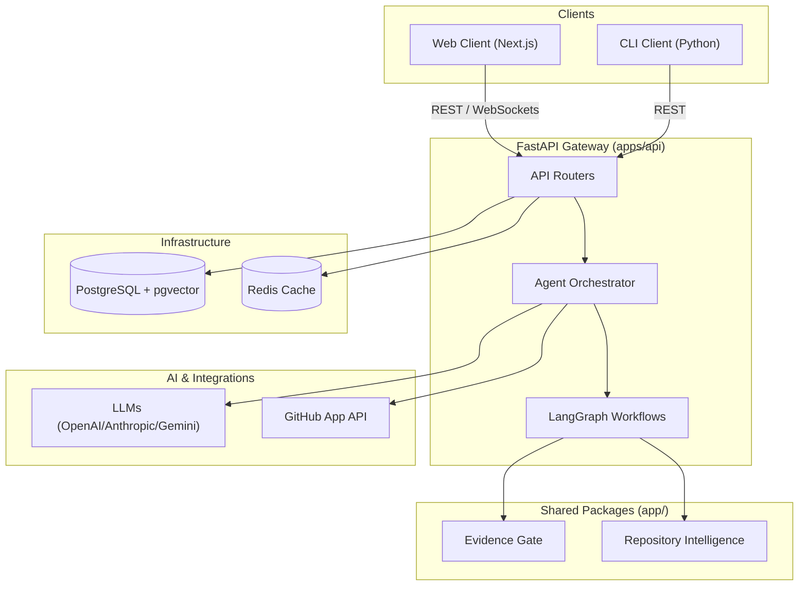

# Repository Map — AgentForge

A complete, top-down discovery and map of the AgentForge repository, outlining core components, folder structures, dependency relationships, and technical architecture.

---

## 1. Repository Overview

| Directory | Purpose | Primary Technologies |
|:---|:---|:---|
| `apps/` | Deployable applications and clients. | Python, TypeScript |
| `apps/api/` | FastAPI backend service and agent workflow engine. | Python, FastAPI, LangGraph |
| `apps/web/` | Premium React/Next.js dashboard and visualization client. | TS, Next.js, TailwindCSS |
| `apps/cli/` | Developer CLI client for ad-hoc tasks and local reviews. | Python, Click |
| `app/` | Shared core packages imported by agent nodes. | Python |
| `app/evidence_gate/` | Verification and checkpoint system logic. | Python |
| `app/repository_intelligence/` | Codebase parsing and context gathering services. | Python, Tree-Sitter |
| `app/validation/` | Verification pipeline helpers and schema validation. | Python |
| `docs/` | Structured project and technical documentation. | Markdown |
| `archive/` | Historical audits, plans, and legacy debug scripts. | Markdown, Python |
| `scripts/` | Project utility and automation scripts. | Bash, Python |
| `tests/` | Global verification and integration test suites. | Python |
| `.github/` | CI/CD configurations and GitHub actions. | YAML |

---

## 2. Architecture Overview

AgentForge is built around a modern distributed agent architecture. Below is a breakdown of the core systems.

### Frontend (`apps/web/`)
The user-facing client is a Next.js 15 web application. It features real-time agent execution status, interactive visual nodes, memory explorers, and custom configuration settings. Auth states are managed via local contexts, automatically attaching JWT tokens to API requests.

### Backend (`apps/api/`)
The system backend is built on FastAPI. It serves REST API endpoints for user authentication, project files, team member settings, task queues, and analytical metrics. The backend operates an asynchronous task runner that triggers multi-agent graphs.

### Agents (`apps/api/agents/`)
Agents are orchestrated using LangGraph state graphs. The sequential and parallel workflow routes states through a set of specialized nodes:
* **Team Lead**: Coordinates task planning and delivers final artifacts.
* **Planner**: Generates requirements and structured schedules.
* **Architect**: Audits designs and assesses system quality.
* **Builder**: Generates the implementation code.
* **Tester**: Synthesizes and executes test scripts.
* **Reviewer**: Evaluates code changes and highlights issues.
* **Deployment**: Validates release safety and builds.

### Database (`core/database.py`)
PostgreSQL is used as the relational system of record, storing projects, teams, tasks, executions, and users. SQLAlchemy and `asyncpg` provide high-performance asynchronous connection pools and transactional operations.

### Memory (`app/memory_service.py`)
Agent memory is persisted in PostgreSQL using the `pgvector` extension. Cosine similarity queries retrieve long-term contextual memories (decisions, code patterns) and inject them into agent prompt states.

### GitHub Integration (`apps/api/app/integrations/`)
The native GitHub App integration receives repository webhooks (PR opened, code pushed), validates HMAC signatures, synchronizes codebase branches, processes code changes, and writes automated review comments back to PR files.

### Bring Your Own Key (BYOK) (`core/providers.py`)
A dynamic provider resolution system resolves key configurations. When executing tasks, keys are resolved in order:
1. **Project Key**: Key assigned to a specific project.
2. **User Key**: Key registered at the user level.
3. **Global Key**: System default credentials from environment variables.

Supported providers include OpenAI, Anthropic, Google Gemini, and generic OpenAI-compatible endpoints.

### Repository Intelligence (`app/repository_intelligence/`)
Generates call graphs, symbol indices, and dependency structures using Tree-Sitter parsing. This module allows agents to fetch precise contextual files and symbols, minimizing token usage and context limits.

### Validation (`app/evidence_gate/`)
The Validation Gate checks that plans, code changes, and deployments meet specified quality, documentation, test coverage, and security requirements. 

---

## 3. Dependency Map

The visual map below outlines the operational flow and dependency boundaries of the AgentForge system:

---

## 4. Code Ownership Map

Major areas of the repository and their technical owners:

| Module | Core Directory | Owner / Reviewer |
|:---|:---|:---|
| Backend Gateway & API | `apps/api/app/` | API / Backend Team |
| Agent Orchestration | `apps/api/agents/` | AI Systems Architect |
| Core Providers & BYOK | `apps/api/core/` | Principal Platform Engineer |
| Database & Migrations | `apps/api/migrations/` | DevOps & DB Administrator |
| Shared Validation Gate | `app/evidence_gate/` | QA & Security Leads |
| Repository Intelligence | `app/repository_intelligence/` | Staff Developer Experience Engineer |
| Frontend Dashboard | `apps/web/` | Frontend & UX Team |
| Console Script & CLI | `apps/cli/` | CLI Maintainers |