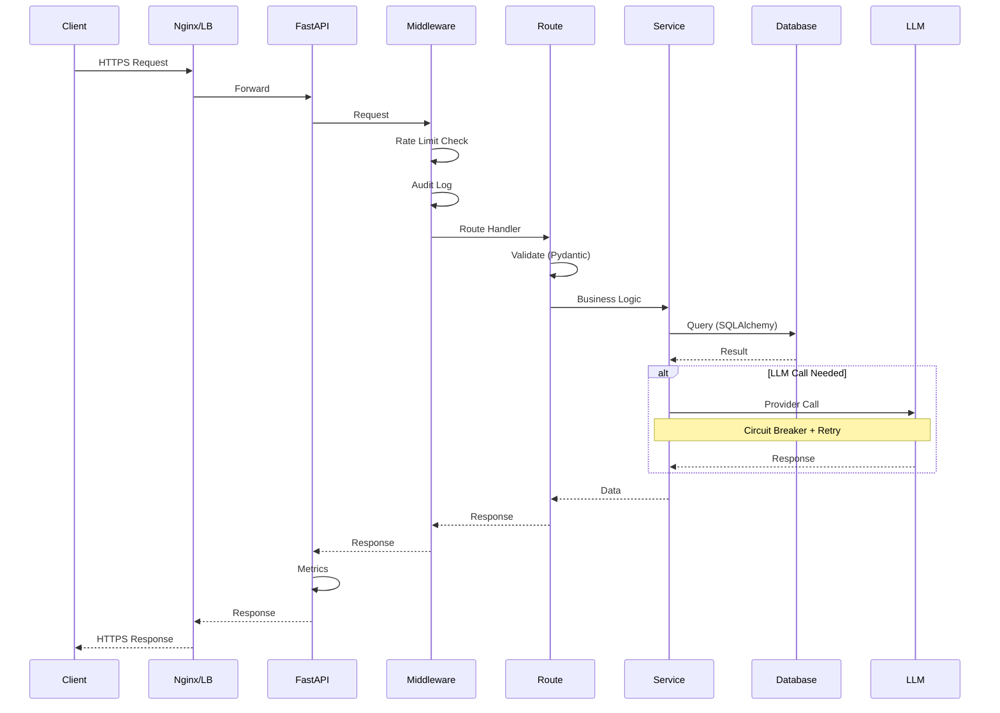
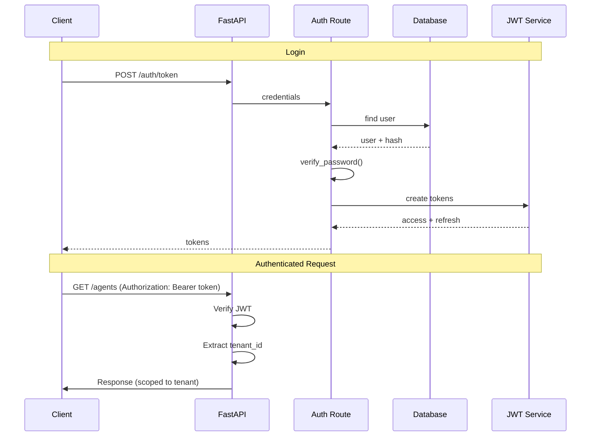
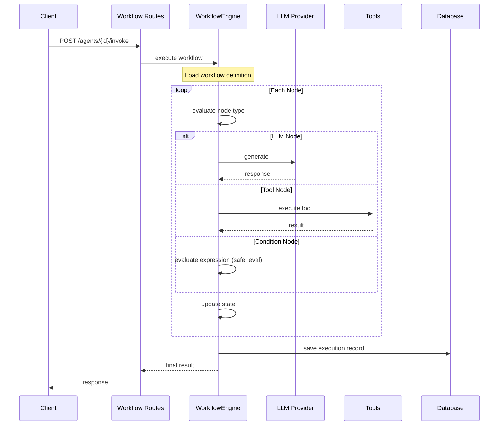
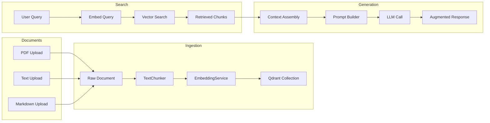
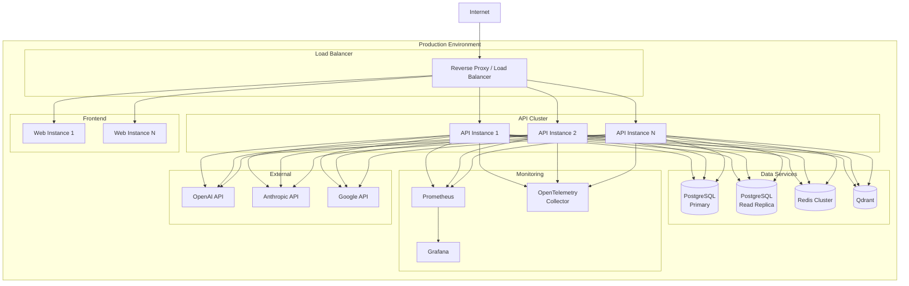

<p align="center">
  <picture>
    <source media="(prefers-color-scheme: dark)" srcset="https://img.shields.io/badge/AgentForge%20AI-000000?style=for-the-badge&logo=python&logoColor=white&label=⚡">
    <source media="(prefers-color-scheme: light)" srcset="https://img.shields.io/badge/AgentForge%20AI-000000?style=for-the-badge&logo=python&logoColor=white&label=⚡">
    
  </picture>
</p>

<p align="center">
  <b>Production-ready open-source platform for building, deploying, monitoring, and scaling AI agents.</b>
</p>

<p align="center">
  FastAPI · Next.js · PostgreSQL · Redis · Qdrant · LangGraph · Prometheus · OpenTelemetry
</p>

<p align="center">
  <a href="#-the-superpowers-core-features"></a>
  <a href="#-the-brain-trust-system-architecture--design"></a>
  <a href="docs/api-reference.md"></a>
  <a href="CONTRIBUTING.md"></a>
  <a href="SECURITY.md"></a>
</p>

<p align="center">
  
  
  
  
  
  
  
  
</p>

<p align="center">
  
  
  
  
  
  
</p>

---

AgentForge AI is an **open-source** platform for orchestrating AI agents in production. It provides an async FastAPI backend with multi-tenant isolation, a LangGraph-powered workflow engine, a full RAG pipeline with vector search, and built-in observability via Prometheus metrics, OpenTelemetry tracing, and structured logging — all wrapped in a Dockerized monorepo with 130 passing tests and 93% launch readiness.

---

## ⚡ Live Feed (Current Status & Build)

| Metric | Value |
|---|---|
| **Version** | `v0.1.0` — Initial pre-release |
| **Tests** | 130 passing — security (63), integration (26), observability (21), API (8) |
| **Coverage** | 78% backend — `core/` 92%, `models/` 100%, `schemas/` 100%, `metrics/` 100% |
| **Production Readiness** | 93% — audited across 6 categories |
| **Security Score** | 95/100 — JWT, bcrypt, tenant isolation, rate limiting, audit logging, safe eval |
| **Launch Status** | 🟢 Ready — all blockers resolved, pre-launch audit complete |
| **License** | MIT |
| **CI** | GitHub Actions — test + lint on push and PR |

## 🗺️ The Star Map (Table of Contents)

- [✨ The Superpowers (Core Features)](#-the-superpowers-core-features)
- [🛠️ The Alchemy (Tech Stack & Tools)](#-the-alchemy-tech-stack--tools)
- [🎬 Act 1: The Awakening (Getting Started)](#-act-1-the-awakening-getting-started)
- [💡 The Playbook (Interactive Usage)](#-the-playbook-interactive-usage)
- [🔭 The Cosmic Horizon (Project Roadmap)](#-the-cosmic-horizon-project-roadmap)
- [🎯 The Blueprint (Feature Roadmap)](#-the-blueprint-feature-roadmap)
- [🕵️ The Glitch Hunt (Testing & Quality Assurance)](#-the-glitch-hunt-testing--quality-assurance)
- [🧠 The Brain Trust (System Architecture & Design)](#-the-brain-trust-system-architecture--design)
- [🤝 Join the Guild (Contributing Framework)](#-join-the-guild-contributing-framework)
- [🛡️ The Bastion (Security & Environment Variables)](#-the-bastion-security--environment-variables)
- [⏳ Time Travel (Changelog & Version History)](#-time-travel-changelog--version-history)
- [📜 The Lexicon (License & Terms)](#-the-lexicon-license--terms)
- [📨 Signal Fire (Drop a Line / Contact)](#-signal-fire-drop-a-line--contact)

---

## ✨ The Superpowers (Core Features)

### 🤖 Agent Orchestration

Create, configure, and invoke AI agents with pluggable LLM backends, custom system prompts, tools, and memory.

| Capability | Implementation |
|---|---|
| Multi-LLM support | OpenAI, Anthropic, Google Gemini via provider abstraction (`LLMProvider` factory) |
| CRUD API | `POST/GET/PUT/DELETE /api/v1/agents` with Pydantic validation |
| Invocation | `POST /api/v1/agents/{id}/invoke` with execution tracking |
| Configuration | Per-agent LLM config (provider, model, temperature, max_tokens), system prompt, tool selection |
| Memory | Pluggable memory backends (`short_term`, `buffer` with configurable turn count) |
| Tenant isolation | All queries scoped by `tenant_id` — no cross-tenant data access |

### 🧠 Workflow Engine

Multi-step agent workflows using LangGraph with conditional branching, tool integration, and state persistence.

| Capability | Implementation |
|---|---|
| Graph execution | LangGraph `WorkflowEngine` with directed node graphs |
| Node types | LLM generation, tool execution, condition evaluation |
| Condition evaluation | AST-based `safe_eval()` — no arbitrary code execution |
| State management | Typed `WorkflowState` with `MemorySaver` checkpointing |
| Schema validation | Pydantic `WorkflowCreate` with `definition` field for nodes/edges |
| Execution recording | Full execution trace with steps, tokens, cost, duration |

### 📚 RAG Platform

Ingest, search, and augment with a complete retrieval-augmented generation pipeline.

| Capability | Implementation |
|---|---|
| Document ingestion | `POST /api/v1/rag/ingest` — text content with metadata |
| File upload | `POST /api/v1/rag/upload` — PDF, TXT, MD (10 MB max, MIME-validated) |
| Text chunking | `TextChunker` with configurable chunk size and overlap |
| Embedding | `EmbeddingService` producing 1536-dimension vectors |
| Vector search | Qdrant-based `POST /api/v1/rag/search` with top_k and score threshold |
| Augmented generation | `POST /api/v1/rag/augment` — retrieve context, build prompt, call LLM |
| Lazy initialization | `_LazyVectorStore` proxy — Qdrant client created on first use only |

### 🔐 Security

Defense-in-depth security architecture validated at startup and enforced at every layer.

| Capability | Implementation |
|---|---|
| JWT authentication | HS256, audience/issuer/expiry/jti validation, 30-min access + 7-day refresh |
| API keys | SHA-256 hashed storage, expiry support, permission scoping |
| Password hashing | bcrypt with per-password random salt |
| Tenant isolation | `tenant_id` filter on every database query |
| Rate limiting | Per-IP, per-endpoint: 100/60s auth token, 10/3600s register, 20/60s upload |
| Audit logging | Automatic POST/PUT/PATCH/DELETE logging with actor, resource, action, IP |
| Expression safety | AST-based `safe_eval()` — only comparisons, boolean ops, dict/list literals |
| File validation | MIME type allowlist, 10 MB size limit, Pydantic boundary validation |
| Secret validation | Startup guard rejects empty, default, or whitespace-only `JWT_SECRET` |

### 📈 Observability

Three-pillar observability with Prometheus metrics, OpenTelemetry tracing, and structured logging.

| Capability | Implementation |
|---|---|
| HTTP metrics | `http_requests_total`, `http_request_duration_seconds`, `http_errors_total` |
| Workflow metrics | `workflow_executions_total`, `workflow_duration_seconds` |
| Agent metrics | `agent_invocations_total`, `token_usage_total` |
| RAG metrics | `rag_queries_total`, `rag_retrieval_latency_seconds` |
| System metrics | `db_connections_active` gauge |
| Distributed tracing | FastAPI, HTTPX, SQLAlchemy instrumented via OpenTelemetry OTLP |
| Structured logging | structlog — JSON in production, colored console in development |
| Health checks | `/live` (process), `/ready` (database), `/health` (all services) |
| Circuit breakers | pybreaker: LLM (5 failures / 60s reset), Qdrant (3/30s), Redis (3/30s) |
| Retry policies | tenacity with exponential backoff: LLM (3 attempts), Qdrant/Redis (2 attempts) |

### 🏗 Infrastructure

Production-ready Docker Compose with health checks, connection pooling, Alembic migrations, and CI.

| Capability | Implementation |
|---|---|
| Docker Compose | PostgreSQL 15, Redis 7 Alpine, Qdrant, API, Web — all with health checks |
| Database pooling | SQLAlchemy `pool_size=20`, `max_overflow=10`, `pool_pre_ping=True` |
| Database migrations | Alembic with async-compatible `env.py`, 2 migrations (schema + audit logs) |
| Monorepo | Turborepo with npm workspaces for API and Web |
| CI/CD | GitHub Actions — runs tests and lint on push and PR |
| Makefile | `dev`, `test`, `lint`, `migrate`, `seed`, `clean` targets |
| Web UI | Next.js 15 App Router with Zustand stores, Tailwind CSS, React Flow |

---

## 🛠️ The Alchemy (Tech Stack & Tools)

### Backend

| Technology | Version | Purpose |
|---|---|---|
| [FastAPI](https://fastapi.tiangolo.com/) | 0.115+ | Async Python web framework |
| [SQLAlchemy](https://www.sqlalchemy.org/) | 2.0+ | Async ORM with connection pooling |
| [Pydantic](https://docs.pydantic.dev/) | 2.9+ | Validation and settings management |
| [Alembic](https://alembic.sqlalchemy.org/) | 1.14+ | Async-compatible database migrations |
| [structlog](https://www.structlog.org/) | 24.4+ | Structured logging |
| [pyjwt](https://pyjwt.readthedocs.io/) | 2.9+ | JWT encoding and verification |

### Frontend

| Technology | Version | Purpose |
|---|---|---|
| [Next.js](https://nextjs.org/) | 15 | React framework with App Router |
| [TypeScript](https://www.typescriptlang.org/) | 5.7+ | Type-safe frontend code |
| [Tailwind CSS](https://tailwindcss.com/) | 3.4+ | Utility-first styling |
| [Zustand](https://github.com/pmndrs/zustand) | — | Lightweight state management |
| [React Flow](https://reactflow.dev/) | — | Workflow graph editor |
| [Recharts](https://recharts.org/) | — | Observability dashboards |

### Databases & Storage

| Technology | Version | Purpose |
|---|---|---|
| [PostgreSQL](https://www.postgresql.org/) | 15 | Primary data store |
| [asyncpg](https://github.com/MagicStack/asyncpg) | 0.30+ | Async PostgreSQL driver |
| [Redis](https://redis.io/) | 7 | Caching, WebSocket pub/sub |
| [Qdrant](https://qdrant.tech/) | latest | Vector similarity search |

### AI & ML

| Technology | Version | Purpose |
|---|---|---|
| [LangChain](https://langchain.com/) | 0.3+ | LLM orchestration framework |
| [LangGraph](https://langchain-ai.github.io/langgraph/) | 0.2+ | Stateful workflow engine |
| [OpenAI SDK](https://github.com/openai/openai-python) | 1.50+ | GPT-4, GPT-4o, GPT-3.5 |
| [Anthropic SDK](https://github.com/anthropics/anthropic-sdk-python) | 0.45+ | Claude 3.5 Sonnet, Claude 3 |
| [Google GenAI SDK](https://github.com/google-gemini/generative-ai-python) | 1.0+ | Gemini Pro and Ultra |

### Infrastructure

| Technology | Purpose |
|---|---|
| [Docker](https://www.docker.com/) / [Compose](https://docs.docker.com/compose/) | Containerized development and deployment |
| [Turborepo](https://turbo.build/repo) | Monorepo build orchestration |
| [GitHub Actions](https://github.com/features/actions) | CI/CD |

### Observability

| Technology | Purpose |
|---|---|
| [Prometheus](https://prometheus.io/) | Metrics collection and querying |
| [OpenTelemetry](https://opentelemetry.io/) | Distributed tracing (OTLP HTTP) |
| [pybreaker](https://github.com/danielfm/pybreaker) | Circuit breaker pattern |
| [tenacity](https://tenacity.readthedocs.io/) | Retry with exponential backoff |

### Testing

| Technology | Purpose |
|---|---|
| [pytest](https://docs.pytest.org/) | Test framework |
| [pytest-asyncio](https://pytest-asyncio.readthedocs.io/) | Async test support |
| [pytest-cov](https://pytest-cov.readthedocs.io/) | Coverage reporting |
| [httpx](https://www.python-httpx.org/) | Async HTTP test client |

---

## 🎬 Act 1: The Awakening (Getting Started)

### Prerequisites

- Python 3.12+ · Node.js 20+ · Docker & Docker Compose

### One-Command Setup

```bash
git clone https://github.com/your-org/agentforge.git
cd agentforge
cp .env.example .env          # Edit .env — set JWT_SECRET and at least one LLM API key
docker compose up -d          # Starts PostgreSQL, Redis, Qdrant, API, Web
```

### Local Development (API only in Docker)

```bash
docker compose up -d postgres redis qdrant    # Infrastructure only
cd apps/api
pip install -r requirements.txt
alembic upgrade head                           # Apply database migrations
uvicorn apps.api.main:app --reload --host 0.0.0.0 --port 8000
```

### Verify

```bash
curl http://localhost:8000/api/v1/health
# → {"status":"healthy","version":"0.1.0","environment":"development","checks":{"database":{"status":"ok"},"redis":{"status":"ok"},"qdrant":{"status":"ok"}}}

curl http://localhost:8000/docs
# → Swagger UI
```

### Makefile Commands

```bash
make dev          # Docker Compose + API
make test         # pytest
make lint         # ruff check + npm lint
make migrate      # alembic upgrade head
make seed         # Seed sample data
make clean        # Remove volumes and caches
```

### Environment Variables (Minimum Required)

| Variable | Required | Default | Description |
|---|---|---|---|
| `JWT_SECRET` | **Yes** | — | HMAC key for JWT (generate: `openssl rand -hex 32`) |
| `DATABASE_URL` | Yes | `postgresql+asyncpg://...` | PostgreSQL connection string |
| `OPENAI_API_KEY` | Conditional | — | Required if `LLM_PROVIDER=openai` |
| `ANTHROPIC_API_KEY` | Conditional | — | Required if `LLM_PROVIDER=anthropic` |
| `GEMINI_API_KEY` | Conditional | — | Required if `LLM_PROVIDER=google` |

Full reference at [docs/setup.md](docs/setup.md) and `.env.example`.

---

## 💡 The Playbook (Interactive Usage)

All API endpoints are prefixed with `/api/v1`.

### Register a user

```bash
curl -X POST http://localhost:8000/api/v1/auth/register \
  -H "Content-Type: application/json" \
  -d '{"username": "alice", "password": "securepass123", "email": "alice@example.com"}'
# → {"user_id":"uuid","access_token":"eyJ...","refresh_token":"eyJ...","token_type":"bearer"}
```

### Login

```bash
curl -X POST http://localhost:8000/api/v1/auth/token \
  -H "Content-Type: application/json" \
  -d '{"username": "alice", "password": "securepass123"}'
# → {"access_token":"eyJ...","refresh_token":"eyJ...","token_type":"bearer","expires_in":1800}
```

Set the token for subsequent requests:
```bash
TOKEN="eyJ..."
```

### Create an agent

```bash
curl -X POST http://localhost:8000/api/v1/agents \
  -H "Content-Type: application/json" \
  -H "Authorization: Bearer $TOKEN" \
  -d '{
    "name": "Research Assistant",
    "slug": "research-assistant",
    "description": "Helps with research tasks",
    "llm_config": {"provider": "openai", "model": "gpt-4o", "temperature": 0.7},
    "system_prompt": "You are a research assistant.",
    "tools": ["web_search", "calculator"]
  }'
# → {"id":"uuid","name":"Research Assistant","slug":"research-assistant",...}
```

### Invoke an agent

```bash
curl -X POST http://localhost:8000/api/v1/agents/{agent_id}/invoke \
  -H "Content-Type: application/json" \
  -H "Authorization: Bearer $TOKEN" \
  -d '{"message": "What is the latest news on AI?"}'
# → {"execution_id":"uuid","status":"completed","output":"...","tokens_used":150,...}
```

### Create a workflow

```bash
curl -X POST http://localhost:8000/api/v1/workflows \
  -H "Content-Type: application/json" \
  -H "Authorization: Bearer $TOKEN" \
  -d '{
    "name": "Customer Support",
    "description": "Handle customer inquiries",
    "definition": {
      "nodes": [
        {"id": "classify", "type": "llm", "config": {"prompt": "Classify the intent"}},
        {"id": "respond", "type": "llm", "config": {"prompt": "Respond appropriately"}}
      ],
      "edges": [
        {"from": "classify", "to": "respond"}
      ]
    }
  }'
```

### Upload a RAG document

```bash
curl -X POST http://localhost:8000/api/v1/rag/upload \
  -H "Authorization: Bearer $TOKEN" \
  -F "file=@document.pdf"
# → {"document_id":"uuid","chunks":12,"status":"indexed"}
```

### Search RAG documents

```bash
curl -X POST http://localhost:8000/api/v1/rag/search \
  -H "Content-Type: application/json" \
  -H "Authorization: Bearer $TOKEN" \
  -d '{"query": "API authentication", "top_k": 5, "threshold": 0.7}'
# → {"results":[{"content":"...","score":0.89,...}],"total":3}
```

### Query metrics

```bash
curl http://localhost:8000/api/v1/observability/usage?days=7 \
  -H "Authorization: Bearer $TOKEN"
# → {"total_executions":42,"total_tokens":15000,"total_cost_usd":0.30,"avg_duration_ms":1200}
```

### Health checks

```bash
curl http://localhost:8000/api/v1/live     # Process liveness
curl http://localhost:8000/api/v1/ready    # Database readiness
curl http://localhost:8000/api/v1/health   # Full system health
curl http://localhost:8000/metrics         # Prometheus metrics
```

### Refresh a token

```bash
curl -X POST http://localhost:8000/api/v1/auth/refresh \
  -H "Content-Type: application/json" \
  -d '{"refresh_token": "eyJ..."}'
# → {"access_token":"eyJ...","refresh_token":"eyJ...","token_type":"bearer"}
```

---

## 🔭 The Cosmic Horizon (Project Roadmap)

### ✅ Completed

| Milestone | Focus | Key Deliverables |
|---|---|---|
| **Security Hardening** | Authentication & data protection | JWT validation, bcrypt hashing, tenant isolation, rate limiting, audit logging, safe eval, upload validation, secret guard |
| **Production Foundation** | Database & operations | Alembic async migrations, connection pooling, coverage reporting, integration tests, Docker validation, production checklist |
| **Observability** | Monitoring & resilience | Prometheus metrics (10 metrics), OpenTelemetry tracing (3 instrumentations), structlog, health checks (3 endpoints), circuit breakers (3 services), retry policies (3 tiers) |
| **OSS Launch Preparation** | Documentation & community | README, 16 docs, CONTRIBUTING, SECURITY, LICENSE, CoC, issue/PR templates, changelog, release process, architecture diagrams, 130 tests at 78% coverage |

---

## 🎯 The Blueprint (Feature Roadmap)

| Version | Timeline | Focus Areas |
|---|---|---|
| **v0.2.0** | Q3 2026 | Redis-backed rate limiting, Grafana dashboards, SLO framework, chaos testing, 80%+ coverage |
| **v0.3.0** | Q3 2026 | Performance benchmarking, SSO/OIDC auth, integration tests with real containers, API versioning |
| **v1.0.0** | Q4 2026 | Production hardening, horizontal scaling guides, multi-region deployment, enterprise SSO |

---

## 🕵️ The Glitch Hunt (Testing & Quality Assurance)

### Test Suite

| File | Tests | Coverage |
|---|---|---|
| `test_security.py` | 63 | JWT, passwords, tenant isolation, safe_eval, uploads, models, schemas, exceptions, API keys, route registration |
| `test_integration.py` | 26 | Auth flow, CRUD, rate limiting, audit logging, vector search, WebSocket, observability, config validation |
| `test_observability.py` | 21 | Health endpoints, Prometheus metrics, OpenTelemetry setup, circuit breakers, retry decorators, structured logging |
| `test_api.py` | 8 | End-to-end route testing: health, auth, agents, workflows, executions, observability |

### Coverage by Module

| Module | Coverage |
|---|---|
| `core/` (config, security, metrics, logging, resilience, telemetry) | 92% |
| `models/` | 100% |
| `schemas/` | 100% |
| `middleware/` | 88% |
| `routes/` | 67% |
| `services/` | 72% |
| **Overall** | **78%** |

### Run Tests

```bash
# All tests
make test
cd apps/api && pytest

# With coverage
pytest --cov=apps/api --cov-report=html

# Specific file
pytest tests/unit/test_security.py -v

# By keyword
pytest -k "health or metric or rate"
```

---

## 🧠 The Brain Trust (System Architecture & Design)

### System Architecture

```mermaid
graph TB
    subgraph "Clients"
        WB[Web Browser]
        API[API Clients]
        WS[WebSocket Clients]
    end

    subgraph "API Layer"
        NX[Next.js Frontend<br/>Port 3000]
        UV[FastAPI ASGI Server<br/>Port 8000]
    end

    subgraph "Middleware"
        L[Logging Middleware]
        R[Rate Limit Middleware]
        A[Audit Middleware]
        M[Metrics Middleware]
    end

    subgraph "Routes"
        AGT[Agent Routes]
        WKF[Workflow Routes]
        EXC[Execution Routes]
        RAG[RAG Routes]
        AUTH[Auth Routes]
        OBS[Observability Routes]
    end

    subgraph "Services"
        AS[AgentService]
        WS[WorkflowService]
        ES[ExecutionService]
        AD[AuditService]
        RP[RAGPipeline]
        VS[VectorStoreService]
        LLM[LLM Provider]
    end

    subgraph "Data Layer"
        DB[(PostgreSQL)]
        RD[(Redis)]
        QD[(Qdrant)]
    end

    subgraph "Observability"
        PM[/metrics]
        HC[/health /ready /live]
        LOG[Structured Logging]
    end

    WB --> NX --> UV
    API --> UV
    WS --> UV
    UV --> L --> R --> A
    A --> M --> AGT & WKF & EXC & RAG & AUTH & OBS
    AGT & WKF & EXC & RAG & AUTH --> AS & WS & ES & AD & RP
    AS & WS & ES & AD --> DB
    AS & WS & ES --> RD
    RP --> VS --> QD
    AS & WKF & RP --> LLM
    AGT & WKF & EXC & RAG & AUTH --> PM & HC & LOG
```

### Request Flow



### Authentication Flow



### Workflow Execution



### RAG Pipeline



### Deployment Architecture



### Key Engineering Decisions

1. **Async-first architecture**: The entire API stack runs on Python asyncio, enabling high concurrency for LLM calls, database queries, and WebSocket connections without thread overhead.

2. **Multi-tenant by design**: Every database query includes `tenant_id` filtering enforced at the service layer, not the application layer. There is no mechanism to bypass tenant isolation — it is baked into every `SELECT`, `UPDATE`, and `DELETE` statement.

3. **Pluggable LLM providers**: The `LLMProvider` abstract base class with factory pattern (`get_llm()`) allows adding new providers in ~50 lines of code. Currently supports OpenAI, Anthropic, and Google Gemini.

4. **Defensive security posture**: JWT secrets are validated at import time with `sys.exit(1)` on failure — the application refuses to start with weak or default credentials. All user-facing code evaluation uses AST parsing (no `eval()` or `exec()`).

5. **Lazy resource initialization**: The Qdrant vector store client is not created until the first search or ingest operation. This eliminates startup failures when Qdrant is unavailable and speeds up test execution.

6. **Structured failure handling**: Circuit breakers prevent cascading failures across LLM, Qdrant, and Redis dependencies. Retry policies use exponential backoff with jitter. Health checks differentiate critical (database) from non-critical (Redis, Qdrant) failures.

---

## 🤝 Join the Guild (Contributing Framework)

We welcome contributions of all sizes. See [CONTRIBUTING.md](CONTRIBUTING.md) for the full guide.

### Quick Start for Contributors

```bash
git checkout develop
git checkout -b feat/my-feature
# Make changes
cd apps/api && pytest          # All tests must pass
cd apps/api && ruff check .    # Lint must pass
git commit -m "feat(api): description"
git push -u origin feat/my-feature
# Open PR to develop branch
```

### Commit Convention

```
<type>(<scope>): <description>

Types: feat, fix, docs, style, refactor, test, chore, security, ops
Scopes: api, web, packages, docs, infra, config
```

### What We Value

- Correctness over speed — every change should maintain or improve test coverage
- Tenant isolation must never be compromised
- New operations should include logging and metrics
- Documentation lives alongside code
- Security review is required for auth-related changes

---

## 🛡️ The Bastion (Security & Environment Variables)

### Security Architecture

| Layer | Measure | Implementation |
|---|---|---|
| **Authentication** | JWT access + refresh tokens | HS256, 30-min access, 7-day refresh, audience/issuer/jti validation |
| **Authentication** | API keys | SHA-256 hashed, expiry support, permission scoping |
| **Authentication** | Password hashing | bcrypt with random salt per password |
| **Authorization** | Tenant isolation | `tenant_id` filter on every SQLAlchemy query |
| **Rate Limiting** | Per-endpoint limits | Auth token (100/60s), register (10/3600s), upload (20/60s) |
| **Audit** | CRUD logging | Actor, action, resource, IP, timestamp — non-blocking |
| **Input Safety** | Expression evaluation | AST-based `safe_eval()` — no arbitrary execution |
| **Input Safety** | File validation | MIME type allowlist, 10 MB limit |
| **Startup** | Secret validation | Empty/default/whitespace JWT_SECRET rejected with `sys.exit(1)` |
| **Network** | CORS | Configurable origins via `CORS_ORIGINS` |
| **Error Handling** | Global exception handlers | Structured JSON errors, no stack leaks in production |

### Environment Variable Reference

See `.env.example` and [docs/setup.md](docs/setup.md) for the complete reference.

| Variable | Default | Description |
|---|---|---|
| `ENVIRONMENT` | `development` | Runtime environment (`development`, `staging`, `production`) |
| `LOG_LEVEL` | `INFO` | Logging verbosity (`DEBUG`, `INFO`, `WARNING`, `ERROR`) |
| `DATABASE_URL` | `postgresql+asyncpg://...` | PostgreSQL connection string |
| `DATABASE_POOL_SIZE` | `20` | SQLAlchemy connection pool size |
| `DATABASE_MAX_OVERFLOW` | `10` | Connection pool overflow limit |
| `REDIS_URL` | `redis://localhost:6379/0` | Redis connection string |
| `QDRANT_URL` | `http://localhost:6333` | Qdrant server URL |
| `QDRANT_API_KEY` | `None` | Qdrant API key |
| `JWT_SECRET` | `""` | HMAC key for JWT (min 32 bytes, **required**) |
| `JWT_ALGORITHM` | `HS256` | JWT signing algorithm |
| `ACCESS_TOKEN_EXPIRE_MINUTES` | `30` | Access token lifetime |
| `REFRESH_TOKEN_EXPIRE_DAYS` | `7` | Refresh token lifetime |
| `LLM_PROVIDER` | `openai` | Default LLM provider |
| `OPENAI_API_KEY` | `None` | OpenAI API key |
| `ANTHROPIC_API_KEY` | `None` | Anthropic API key |
| `GEMINI_API_KEY` | `None` | Google Gemini API key |
| `CORS_ORIGINS` | `["http://localhost:3000"]` | Allowed CORS origins |
| `ENABLE_METRICS` | `true` | Enable Prometheus metrics |
| `ENABLE_TRACING` | `false` | Enable OpenTelemetry tracing |
| `ENABLE_JSON_LOGS` | `false` | JSON log format (set `true` in production) |
| `LLM_TIMEOUT_SECONDS` | `60` | LLM call timeout |
| `QDRANT_TIMEOUT_SECONDS` | `30` | Qdrant call timeout |
| `REDIS_TIMEOUT_SECONDS` | `5` | Redis call timeout |
| `RATE_LIMIT_REQUESTS` | `100` | Default rate limit requests per window |
| `RATE_LIMIT_PERIOD` | `60` | Rate limit window in seconds |
| `MAX_UPLOAD_SIZE` | `10485760` | Max upload size in bytes (10 MB) |
| `ALLOWED_UPLOAD_MIME_TYPES` | `[pdf, txt, md]` | Accepted MIME types for upload |

---

## ⏳ Time Travel (Changelog & Version History)

### v0.1.0 (2026-06-25)

**Core Platform**: FastAPI async backend, multi-tenant architecture, JWT + API key authentication, agent CRUD and invocation, workflow engine (LangGraph), RAG pipeline with vector search, WebSocket streaming, PostgreSQL + Redis + Qdrant.

**Security**: JWT (HS256, audience/issuer/expiry/jti), bcrypt password hashing, SHA-256 API keys, tenant isolation, rate limiting, audit logging, AST-based safe eval, file upload validation, startup secret validation, CORS.

**Observability**: Prometheus metrics (10 metrics), OpenTelemetry tracing (3 instrumentations), structlog (JSON/console), 3 health check endpoints, circuit breakers (3 services), retry policies (3 tiers).

**Testing**: 130 tests, 78% coverage, GitHub Actions CI.

Full changelog at [CHANGELOG.md](CHANGELOG.md).

---

## 📜 The Lexicon (License & Terms)

AgentForge AI is released under the [MIT License](LICENSE).

```
MIT License

Copyright (c) 2026 AgentForge AI

Permission is hereby granted, free of charge, to any person obtaining a copy
of this software and associated documentation files (the "Software"), to deal
in the Software without restriction, including without limitation the rights
to use, copy, modify, merge, publish, distribute, sublicense, and/or sell
copies of the Software, and to permit persons to whom the Software is
furnished to do so, subject to the following conditions:

The above copyright notice and this permission notice shall be included in all
copies or substantial portions of the Software.
```

---

## 📨 Signal Fire (Drop a Line / Contact)

- **Bug reports**: [GitHub Issues](https://github.com/your-org/agentforge/issues) — use the bug report template
- **Feature requests**: [GitHub Issues](https://github.com/your-org/agentforge/issues) — use the feature request template
- **Security vulnerabilities**: **Do not** file a public issue. Email **security@agentforge.ai** or use the security report template. See [SECURITY.md](SECURITY.md) for our responsible disclosure policy.
- **Discussions**: Coming soon — GitHub Discussions will be enabled post-launch
- **Contributing**: See [CONTRIBUTING.md](CONTRIBUTING.md) for coding standards, commit conventions, and PR workflow

---

<p align="center">
  <a href="docs/architecture.md">Architecture</a> ·
  <a href="docs/api-reference.md">API Reference</a> ·
  <a href="docs/observability.md">Observability</a> ·
  <a href="docs/security.md">Security</a> ·
  <a href="docs/testing.md">Testing</a> ·
  <a href="docs/deployment.md">Deployment</a> ·
  <a href="docs/roadmap.md">Roadmap</a>
</p>

<p align="center">
  <sub>Built with the AI agent community in mind · MIT Licensed · v0.1.0</sub>
</p>
