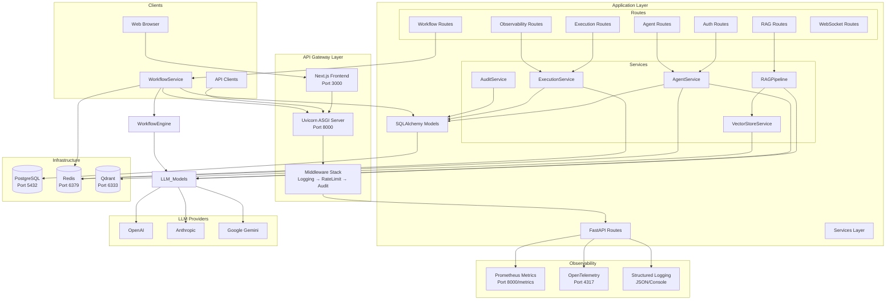

# Architecture

## High-Level Architecture



## Module Map

```
agentforge/
├── apps/
│   ├── api/              # FastAPI backend
│   │   ├── core/         # Config, database, security, health, metrics
│   │   ├── routes/       # API route handlers
│   │   ├── services/     # Business logic
│   │   ├── middleware/    # Logging, rate limiting, audit
│   │   ├── models/       # SQLAlchemy ORM models
│   │   ├── schemas/      # Pydantic validation schemas
│   │   └── dependencies/ # FastAPI dependency injection
│   └── web/              # Next.js frontend
│       ├── app/          # Next.js App Router pages
│       ├── components/   # React components
│       └── stores/       # Zustand state management
├── packages/
│   ├── agents/           # Agent orchestration
│   ├── llm/              # LLM provider abstraction
│   ├── memory/           # Memory/persistence
│   ├── observability/    # Shared observability primitives
│   ├── rag/              # RAG primitives
│   ├── shared/           # Shared types and utilities
│   ├── tools/            # Tool definitions
│   └── workflows/        # Workflow execution engine
├── infrastructure/       # Docker, Kubernetes, Terraform
├── tests/                # Test suite
└── docs/                 # Documentation
```

## Technology Stack

| Component | Technology | Purpose |
|---|---|---|
| **API Framework** | FastAPI | Async Python web framework |
| **ORM** | SQLAlchemy 2.0 (async) | Database abstraction and migrations |
| **Database** | PostgreSQL 15 | Primary data store |
| **Cache** | Redis 7 | Session cache, WS pub/sub |
| **Vector DB** | Qdrant | Vector similarity search |
| **LLM** | LangChain + direct APIs | Multi-provider LLM orchestration |
| **Workflows** | LangGraph | Stateful agent workflow engine |
| **Frontend** | Next.js 15 + React | Web UI |
| **Auth** | JWT + API Keys | Authentication and authorization |
| **Monitoring** | Prometheus | Metrics collection |
| **Tracing** | OpenTelemetry | Distributed tracing |
| **Logging** | structlog | Structured logging |
| **Async** | asyncio | Async runtime |
| **Build** | Turborepo | Monorepo build orchestration |

## Key Design Decisions

1. **Async-First**: API built on asyncio for high concurrency
2. **Multi-Tenant**: Tenant isolation at database query level
3. **Pluggable LLMs**: Provider abstraction via `LLMProvider` base class
4. **Lazy Vector Store**: Qdrant client initialized on first use only
5. **Defensive Security**: JWT validation, rate limiting, audit logging, safe expression evaluation
