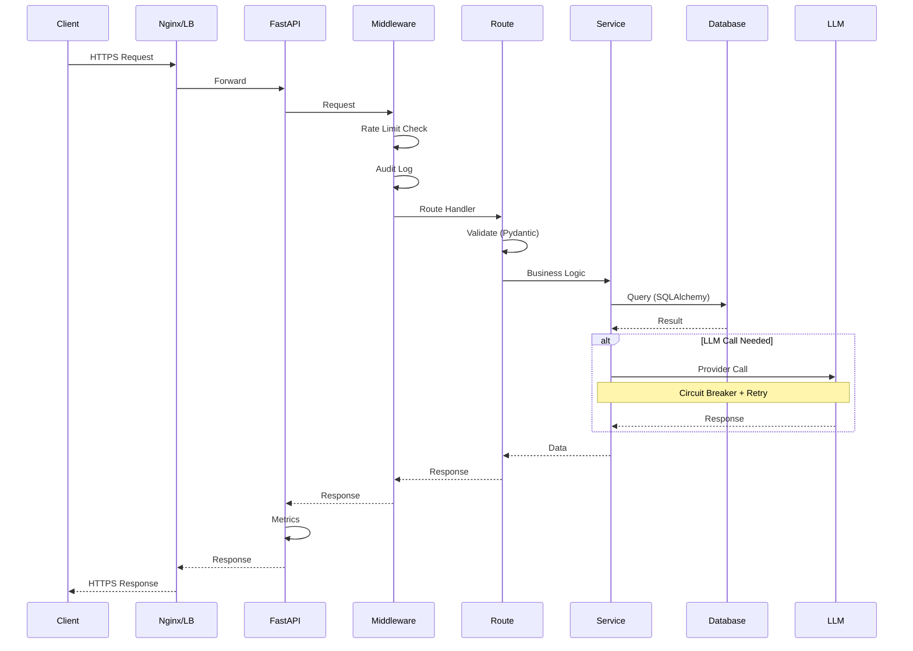
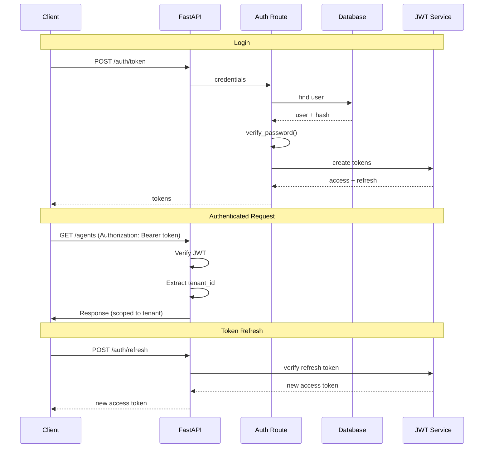
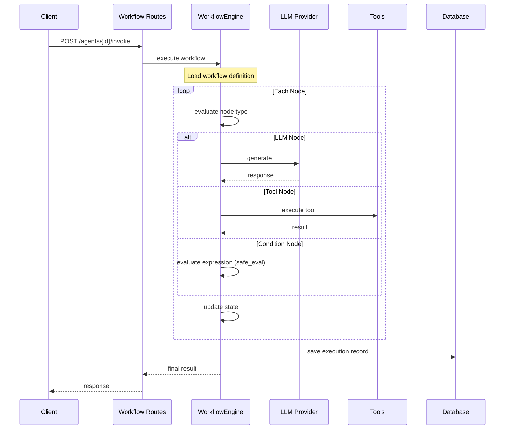
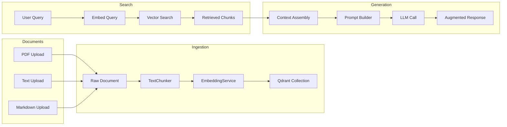
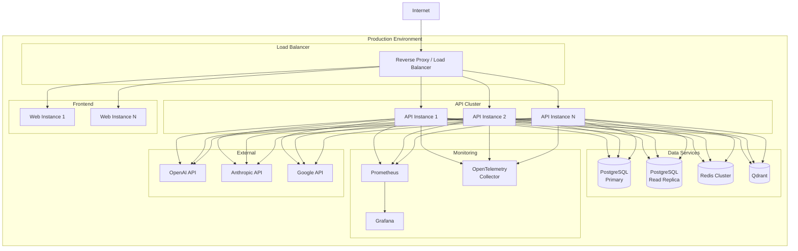

# Architecture Diagrams

## System Architecture

```mermaid
graph TB
    subgraph "Clients"
        WB[Web Browser]
        API[API Clients]
        WS[WebSocket Clients]
    end

    subgraph "API Layer"
        NX[Next.js Frontend<br/>Port 3000]
        UV[FastAPI ASGI Server<br/>Port 8000]
    end

    subgraph "Middleware"
        L[Logging Middleware]
        R[Rate Limit Middleware]
        A[Audit Middleware]
        M[Metrics Middleware]
    end

    subgraph "Routes"
        AGT[Agent Routes]
        WKF[Workflow Routes]
        EXC[Execution Routes]
        RAG[RAG Routes]
        AUTH[Auth Routes]
        OBS[Observability Routes]
    end

    subgraph "Services"
        AS[AgentService]
        WS[WorkflowService]
        ES[ExecutionService]
        AD[AuditService]
        RP[RAGPipeline]
        VS[VectorStoreService]
        LLM[LLM Provider]
    end

    subgraph "Data Layer"
        DB[(PostgreSQL)]
        RD[(Redis)]
        QD[(Qdrant)]
    end

    subgraph "Observability"
        PM[/metrics]
        HC[/health /ready /live]
        LOG[Structured Logging]
    end

    WB --> NX --> UV
    API --> UV
    WS --> UV
    UV --> L --> R --> A
    A --> M --> AGT & WKF & EXC & RAG & AUTH & OBS
    AGT & WKF & EXC & RAG & AUTH --> AS & WS & ES & AD & RP
    AS & WS & ES & AD --> DB
    AS & WS & ES --> RD
    RP --> VS --> QD
    AS & WKF & RP --> LLM
    AGT & WKF & EXC & RAG & AUTH --> PM & HC & LOG
```

## Request Flow



## Authentication Flow



## Workflow Execution



## RAG Pipeline



## Deployment Architecture


