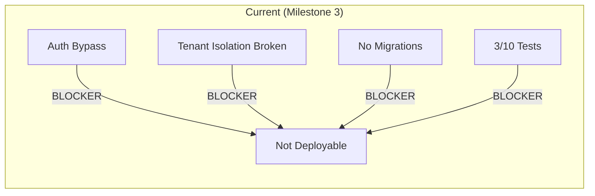

# Repository Audit — AgentForge AI

> **Date:** 2026-06-25  
> **Scope:** Full-stack monorepo audit (backend API, frontend, packages, infrastructure)  
> **Type:** Pre-Milestone-4 Engineering Review  
> **Mode:** Review only — no features added

---

## Section 1 — Executive Summary

### Repository Overview

AgentForge AI is a production-grade AI agent orchestration platform built as a Turborepo monorepo. The stack is FastAPI (Python 3.12) + Next.js 15 (React 19) with PostgreSQL, Redis, Qdrant, and LangGraph for workflow orchestration. The codebase targets developers building, deploying, monitoring, and scaling AI agents.

**Stats:** 81 source files, ~31 API routes, ~7,500 lines of backend Python, ~1,200 lines of TypeScript/React, 10 passing unit tests.

### Current Capabilities

- Agent CRUD with JWT + API key dual authentication
- Workflow engine with LangGraph state graphs (planner → dev → tester → reviewer)
- LLM provider abstraction (OpenAI, Anthropic, Gemini with mock fallback)
- RAG pipeline (document ingestion, chunking, embedding, Qdrant vector search, prompt augmentation)
- WebSocket streaming for execution events
- Execution tracking with token + cost + duration metrics
- Observability aggregate metrics
- Multi-tenant data model (tenant_id on all entities)
- File upload for RAG documents
- Turbo monorepo with npm workspaces

### Technical Strengths

1. **Clean layered architecture:** Routes → Services → Models → DB with clear separation of concerns
2. **Async-native throughout:** FastAPI async endpoints, async SQLAlchemy, async Qdrant client
3. **Well-structured monorepo:** Separate apps/api, apps/web, packages/* with independent concerns
4. **Consistent REST API design:** Proper HTTP methods, status codes, URL conventions
5. **Good base models:** All entities have UUID PKs, tenant_id, timestamps, JSON flexible fields
6. **Pydantic v2 schemas with validators** on AgentCreate (slug pattern, name length)
7. **LangGraph integration** for purpose-built agent workflow state machines
8. **Qdrant vector store** with configurable HNSW parameters
9. **Structured exception hierarchy** with registered handlers
10. **CORS configuration present** (development-default origins)

### Current Limitations

1. **Authentication is completely bypassed** — any username/password pair generates valid tokens; no user database or credential verification exists
2. **Tenant isolation is broken** — Agent, Workflow, and Execution GET/PUT/DELETE endpoints do not filter by tenant_id; cross-tenant data access is possible by UUID guess
3. **Logging bootstrap is dead code** — `bootstrap_logging()` is imported but never called; structlog is not initialized
4. **Metrics `days` parameter is silently ignored** — `get_metrics()` accepts a `days` param but never applies it to queries
5. **No migrations** — `Base.metadata.create_all` on every startup is a development-only antipattern
6. **No database connection resilience** — no `pool_pre_ping`, `pool_recycle`, or `pool_timeout`
7. **JWT tokens lack revocation** — no `jti` claim, no blacklist, logout is a no-op
8. **No rate limiting** — settings define rate limits but no middleware is wired
9. **File upload has no size limit** — OOM DoS via multi-GB file upload
10. **No frontend error boundaries** — uncaught render errors crash the entire SPA

### Scorecard

| Dimension | Score | Rationale |
|-----------|-------|-----------|
| **Architecture** | 6/10 | Clean layering but broken isolation and no event-driven patterns |
| **Security** | 2/10 | Auth is completely bypassed, tenant isolation broken, JWT has no revocation |
| **Scalability** | 4/10 | No connection pooling resilience, no caching, no async task queue |
| **Maintainability** | 6/10 | Consistent patterns but copy-paste issues, dead code, no migration system |
| **Documentation** | 3/10 | ADRs exist but docs/ directory is missing from the repo root |
| **Testing** | 3/10 | 10 unit tests, no integration, no e2e, 0% coverage measurement |
| **DevOps** | 4/10 | Docker compose exists but untested; no staging/prod config, no migration pipeline |
| **Developer Experience** | 5/10 | Turbo monorepo, consistent naming, but missing lint config, no pre-commit hooks working |

**Overall Production Readiness Score: 3/10**  
*Not production-deployable without addressing the critical authentication and tenant isolation issues.*

---

## Section 2 — Architecture Review

### Service Boundaries

```
apps/api/
  main.py              ← App factory, lifespan, middleware, router mounts
  core/                ← Config, database, security, exceptions, logging
  dependencies/        ← Auth (JWT + API key), tenant extraction
  middleware/          ← Request logging middleware
  models/              ← SQLAlchemy ORM (Agent, Workflow, Execution, APIKey)
  schemas/             ← Pydantic v2 request/response models
  services/            ← Business logic (Agent, Workflow, Execution, Vector Store, RAG)
  routes/              ← HTTP handlers (auth, agents, workflows, executions, observability, rag, ws)
```

**Issue:** Services contain both business logic AND database queries with no repository/DAO layer. This couples business rules to SQLAlchemy, making unit testing harder.

### Dependency Flow

```
Routes → Services → Models (SQLAlchemy) / Vector Store (Qdrant) / RAG Pipeline
         ↑
    Dependencies (auth, tenant)
         ↑
    Config / Security / Exceptions
```

**Issue:** `packages/llm/src/__init__.py` imports from `apps.api.core.config` (via `get_llm`). This creates a dependency from a shared package into the API app, violating the monorepo dependency direction (packages should be independent).

### Package Structure

```
packages/
  agents/src/         ← Empty init only
  llm/src/            ← OpenAI, Anthropic providers
  memory/src/         ← Empty init only
  observability/src/  ← Empty init only
  rag/src/            ← Empty init only
  shared/src/         ← Empty init only
  tools/src/          ← Tool registry (web_search, calculator, datetime)
  workflows/src/      ← LangGraph workflow engine
```

**Issue:** 5 of 8 packages are empty placeholder files. Only `llm`, `tools`, and `workflows` have any implementation. The package structure suggests a richer shared library than actually exists.

### API Design Issues

| Path | Method | Issue |
|------|--------|-------|
| `POST /api/v1/auth/token` | POST | Accepts any credentials; no password verification |
| `POST /api/v1/auth/refresh` | POST | Does not decode/verify the refresh token |
| `POST /api/v1/auth/logout` | POST | No-op; does not invalidate tokens |
| `GET /api/v1/agents/{id}` | GET | No tenant filter — cross-tenant read |
| `PUT /api/v1/agents/{id}` | PUT | No tenant filter — cross-tenant update |
| `DELETE /api/v1/agents/{id}` | DELETE | No tenant filter — cross-tenant delete |
| `GET /api/v1/workflows/{id}` | GET | No tenant filter |
| `PUT /api/v1/workflows/{id}` | PUT | No tenant filter |
| `DELETE /api/v1/workflows/{id}` | DELETE | No tenant filter |
| `GET /api/v1/executions/{id}` | GET | No tenant filter |
| `POST /api/v1/agents/{id}/invoke` | POST | No agent-tenant ownership check |
| `GET /api/v1/observability/usage` | GET | `days` parameter silently ignored |
| `POST /api/v1/rag/upload` | POST | No file size limit (DoS vector) |

### Workflow Engine Design

The `packages/workflows/src/__init__.py` uses LangGraph `StateGraph` with a `MemorySaver` checkpointer. Nodes are evaluated using Python's `eval()` for condition expressions:

```python
result = eval(expression, {"__builtins__": {}}, {"state": state, "output": state.get("output")})
```

**Critical Issue:** `eval()` is used to evaluate workflow condition expressions. Even with `{"__builtins__": {}}`, Python `eval()` is known to be escapable (attribute access via `().__class__.__bases__` chains). This is an RCE vector if workflow definitions are user-controlled.

### Event Architecture

No event bus or message queue exists. The codebase has:
- No background task processing (task queue like Celery/ARQ)
- No pub/sub beyond the in-memory WebSocket ConnectionManager
- No webhook support
- No async event logging

---

## Section 3 — Security Review

### OWASP Risk Assessment

| OWASP Category | Risk Level | Finding |
|----------------|------------|---------|
| A1: Broken Access Control | **CRITICAL** | No tenant filter on individual resource GET/PUT/DELETE |
| A2: Cryptographic Failures | **CRITICAL** | Default JWT secret `"change-this-in-production"` |
| A3: Injection | **HIGH** | `eval()` in workflow engine; no input sanitization on LLM prompts |
| A4: Insecure Design | **HIGH** | Auth bypass — no credential verification |
| A5: Security Misconfiguration | **HIGH** | CORS with `allow_origins: ["*"]` + `allow_credentials: True` is invalid |
| A6: Vulnerable Components | **MEDIUM** | `passlib` is unmaintained since 2022 |
| A7: Identification/Auth Failures | **CRITICAL** | Refresh tokens not verified; logout is no-op |
| A8: Software/Data Integrity | **LOW** | No SBOM, no signature verification |
| A9: Security Logging/Monitoring | **MEDIUM** | Auth failures not logged; no audit trail |
| A10: SSRF | **LOW** | LLM providers accept URLs from config only |

### Authentication Findings

**CRITICAL — No Credential Verification** (`routes/auth.py:28`)
```python
async def login(credentials: LoginRequest):
    if not credentials.username or not credentials.password:
        raise HTTPException(status_code=400, detail="Invalid credentials")
    extra = {"tenant_id": credentials.username}
    access_token = create_access_token(subject=credentials.username, extra_claims=extra)
```
The function checks that strings are non-empty but never looks up a user or verifies a password. The `verify_password` and `hash_password` functions are imported but never called. Any username/password pair (including `"a"/"b"`) generates a valid signed JWT.

**CRITICAL — Refresh Token Not Verified** (`routes/auth.py:38`)
```python
async def refresh(data: RefreshRequest):
    access_token = create_access_token(subject=data.refresh_token)
```
The raw refresh token string is used as the `subject` for new tokens. No signature verification, no expiry check, no user identity extraction.

**CRITICAL — JWT Secret Default** (`core/config.py:28`)
```python
JWT_SECRET: str = "change-this-in-production"
```
If `.env` is missing or the env var is unset, this literal string is used. Anyone who reads the source code can forge valid tokens.

**HIGH — No JWT `jti` (Token ID)** — Individual token revocation is impossible.
**HIGH — No `aud`/`iss` validation** — Tokens could be reused across services.
**HIGH — No token blacklist** — Logout cannot invalidate existing tokens.
**MEDIUM — Token in WebSocket query string** — Logged by proxies, visible in browser history.

### Authorization Findings

**CRITICAL — 9 routes lack tenant isolation.** The following routes do not filter by `tenant_id`:

- `GET /api/v1/agents/{agent_id}` ← routes/agents.py:44
- `PUT /api/v1/agents/{agent_id}` ← routes/agents.py:57
- `DELETE /api/v1/agents/{agent_id}` ← routes/agents.py:71
- `GET /api/v1/workflows/{workflow_id}` ← routes/workflows.py:43
- `PUT /api/v1/workflows/{workflow_id}` ← routes/workflows.py:56
- `DELETE /api/v1/workflows/{workflow_id}` ← routes/workflows.py:70
- `GET /api/v1/executions/{execution_id}` ← routes/executions.py:34
- `POST /api/v1/agents/{agent_id}/invoke` ← routes/agents.py:83 (uses tenant_id for execution creation but not for agent ownership check)

**Root cause:** `AgentService.get()`, `WorkflowService.get()`, and `ExecutionService.get()` in `services/__init__.py` query by ID only, without a `tenant_id` filter.

### Input Validation Findings

| Issue | Severity | Location |
|-------|----------|----------|
| No `extra="forbid"` on request schemas | MEDIUM | All Pydantic create/update schemas |
| File upload with no size limit | CRITICAL | `routes/rag.py:54` — `await file.read()` |
| `eval()` in workflow conditions | CRITICAL | `packages/workflows/src/__init__.py:86` |
| LLM invoke input_data is bare `dict` | MEDIUM | `routes/agents.py:86` |
| Error details leaked in 500 responses | MEDIUM | `routes/agents.py:144` — `detail=str(e)` |
| No request size limit middleware | MEDIUM | App-wide |

### Privilege Escalation Risks

1. **Cross-tenant data access** — Attacker registers as tenant A, enumerates UUIDs for agents/workflows belonging to tenant B
2. **Cross-tenant data modification** — Same route pattern for PUT/DELETE
3. **Token forgery** — Anyone with source access can sign tokens due to hardcoded default secret
4. **Workflow RCE** — `eval()` in condition nodes allows arbitrary code execution if workflow definitions are user-controllable

### API Security Gaps

- No rate limiting (settings define values, no middleware)
- No request signing (HMAC request signing for API keys)
- No IP allowlisting/denylisting
- No CORS origin validation beyond string comparison
- No security headers middleware (HSTS, CSP, X-Frame-Options)
- No CSRF protection for cookie-based auth (future concern)

---

## Section 4 — Database Review

### Schema Overview

```
agents
  id (UUID, PK), tenant_id (UUID, indexed), name, slug, description,
  llm_config (JSON), system_prompt (TEXT), tools (JSON), memory_config (JSON),
  version (INT), status (VARCHAR), created_at, updated_at
  UNIQUE(tenant_id, slug)

workflows
  id (UUID, PK), tenant_id (UUID, indexed), name, description,
  definition (JSON), version (INT), status (VARCHAR),
  created_at, updated_at

executions
  id (UUID, PK), tenant_id (UUID, indexed), agent_id (UUID, FK), workflow_id (UUID, FK),
  input (JSON), output (JSON), status (VARCHAR), steps (JSON),
  total_tokens (INT), total_cost_usd (FLOAT), duration_ms (INT),
  error (TEXT), created_at, completed_at

api_keys
  id (UUID, PK), tenant_id (UUID, indexed), name, key_hash (VARCHAR),
  key_prefix (VARCHAR), permissions (JSON), expires_at, created_at, last_used_at
```

### Missing Indexes

| Table | Column | Impact | Priority |
|-------|--------|--------|----------|
| `executions` | `agent_id` | Sequential scan for agent execution history | **HIGH** |
| `executions` | `workflow_id` | Sequential scan for workflow execution history | **HIGH** |
| `executions` | `(tenant_id, status)` | Status-based tenant queries (dashboard) | **MEDIUM** |
| `executions` | `(tenant_id, created_at)` | Time-range queries for observability | **MEDIUM** |
| `api_keys` | `key_hash` | API key auth lookup | **MEDIUM** |
| `api_keys` | `tenant_id` | Already indexed | OK |

### Potential N+1 Queries

1. **Execution list → agent name:** The `GET /api/v1/executions` endpoint returns execution records with `agent_id` UUIDs but not the agent names. The frontend would need to make N additional API calls to resolve names.
2. **Agent list → executions count:** There's no `executions_count` field on the Agent response. To show execution counts in the agent list view, the frontend would need counts per agent via separate queries.

### Scaling Bottlenecks

| Bottleneck | Risk | Mitigation |
|------------|------|------------|
| `expire_on_commit=False` | Stale reads within request lifecycle | Enable expiration or use explicit refresh |
| `create_all` on startup | Race condition with multiple replicas | Alembic migrations |
| No `pool_pre_ping` | Dead connections served after DB restart | Add `pool_pre_ping=True` |
| No `pool_recycle` | Connection leaks after 8-hour default MySQL timeout | Set `pool_recycle=3600` |
| JSON columns for `llm_config`, `tools`, etc. | Not filterable/indexable at DB level | Consider pgvector or separate tables for high-cardinality fields |
| `AsyncAdaptedQueuePool` default | May queue excessively under high concurrency | Tune pool parameters or switch to `NullPool` for serverless |
| No read replicas | All traffic hits one writer | Future: read/write splitting |

### Migration Strategy

**Current state:** `Base.metadata.create_all()` runs on every startup.

**Required:** Alembic with:
- Initial migration for all 4 tables
- `check_migration` endpoint at `/api/v1/health/db`
- Migration run as a separate init container in Docker Compose
- Downgrade support for rollbacks

---

## Section 5 — RAG Review

### Chunking Strategy

`TextChunker` in `services/rag.py`:

- Default chunk size: 512 characters
- Default overlap: 64 characters (~12.5%)
- Separators: `["\n\n", "\n", ".", " ", ""]`
- Sliding window with separator-aware boundaries

**Evaluation:**

| Criterion | Score | Notes |
|-----------|-------|-------|
| Semantic coherence | **MEDIUM** | Character-based (not token-based); may split sentences awkwardly |
| Separator priority | **GOOD** | Paragraph → line → sentence → word → character fallback |
| Overlap ratio | **GOOD** | 12.5% is within the standard 10-20% range |
| Recursive splitting | **ABSENT** | No recursive splitting for oversized chunks after separator split |

**Issues:**
- No token-aware chunking (OpenAI tiktoken for token counting)
- No semantic chunking (LLM-based boundary detection)
- No support for structured documents (PDF, HTML, Markdown with heading-aware splitting)
- Single chunker instance shared globally (cannot configure per-document)

### Embedding Pipeline

`EmbeddingService` in `services/vector_store.py`:

- OpenAI `text-embedding-3-small` (1536 dimensions)
- Mock fallback with deterministic SHA-256 hashing when API key is absent
- New `AsyncOpenAI` client created per `embed()` call (no client reuse)

**Evaluation:**

| Criterion | Score | Notes |
|-----------|-------|-------|
| Embedding quality | **GOOD** | OpenAI ada-002 is SOTA for production |
| Client reuse | **POOR** | New HTTP client per embed call = resource waste |
| Fallback behavior | **POOR** | Silent garbage output with no warning log |
| Batch efficiency | **GOOD** | Single API call for all texts in a batch |
| Multi-provider | **ABSENT** | Only OpenAI embeddings supported |

### Vector Search

`VectorStoreService.search()` in `services/vector_store.py`:

- Dense cosine similarity search
- Optional `score_threshold` filtering
- Payload filter support (exact match + range)
- No hybrid search (sparse + dense)
- No bm25/SPLADE keyword fallback

**Evaluation:**

| Criterion | Score | Notes |
|-----------|-------|-------|
| Search quality | **GOOD** | Cosine on 1536-dim embeddings is standard |
| Filter support | **GOOD** | Match + range filters implemented |
| Threshold filtering | **GOOD** | Post-query score threshold |
| Hybrid search | **ABSENT** | No keyword/BM25 fallback for out-of-domain queries |
| Re-ranking | **ABSENT** | No cross-encoder re-ranking |
| Pagination | **GOOD** | Scroll API available |

### Citation Support

**ABSENT.** The RAG pipeline does not:
- Return source document IDs in augmented prompts
- Include chunk positions or document metadata in the context
- Support citation formatting (e.g., `[1]` or `(source: doc.pdf)`)
- Verify citation accuracy against source documents

### Context Window Efficiency

`augment_prompt()` concatenates context chunks with no regard for:
- Total token count (may exceed LLM context window)
- Relevance ranking (inserted in score order, but no trimming)
- Deduplication (same document may contribute overlapping chunks)

---

## Section 6 — Testing Review

### Current Coverage

| Layer | Tests | Coverage | Notes |
|-------|-------|----------|-------|
| **API unit tests** | 10 | ~15% of routes | Only 10 tests for 31 routes |
| **Service tests** | 0 | 0% | No direct service-layer tests |
| **Integration tests** | 0 | 0% | No DB integration tests |
| **E2E tests** | 0 | 0% | No full-stack tests |
| **Frontend tests** | 0 | 0% | No component or page tests |
| **Package tests** | 0 | 0% | No tests for llm, tools, workflows |

### Missing Test Areas

**Backend (Priority order):**

1. **Authentication** — Refresh token flow, expired token handling, invalid signature, malformed token
2. **Tenant isolation** — Verify Tenant A cannot access Tenant B's resources on every endpoint
3. **Agent CRUD** — Create with duplicate slug, update with invalid fields, delete non-existent
4. **Workflow CRUD** — Same edge cases as agents
5. **Agent invoke** — LLM timeout, massive input, concurrent invocations
6. **RAG ingestion** — Empty document, very large document, unsupported encoding, duplicate document_id
7. **RAG search** — Empty corpus, misspelled queries, filter edge cases, score threshold boundary
8. **Observability** — Zero executions, single execution, pagination edge cases
9. **WebSocket** — Connection with invalid token, concurrent connections, message flooding
10. **Rate limiting** — Burst behavior, per-endpoint limits
11. **Error handling** — Database disconnection mid-request, concurrent modification
12. **Input validation** — SQL injection attempts, XSS payloads, oversized payloads

**Frontend (Priority order):**

1. **API client error handling** — Network timeout, 4xx, 5xx, malformed JSON responses
2. **Agent detail page** — Loading state, error state, empty executions list
3. **Agent create flow** — Form validation, duplicate slug handling, server errors
4. **Workflow list page** — Empty state, loading skeleton, error state
5. **State management** — Store race conditions, stale data after navigation
6. **Edge cases** — Very long agent names, special characters, rapid form submission

### Testing Infrastructure Gaps

- No coverage measurement (`pytest-cov` not in requirements)
- No CI test runner configuration beyond `turbo test`
- No test database management (isolation between test runs)
- No API contract tests (no OpenAPI/Swagger validation in tests)
- No performance/load tests
- No security/fuzz tests

### Target: 80% Backend Coverage

To achieve 80%, the following must be implemented:

| Metric | Current | Target | Delta |
|--------|---------|--------|-------|
| Route handler coverage | ~20% | 100% | +80% |
| Service coverage | 0% | 90% | +90% |
| Schema validation coverage | ~10% | 100% | +90% |
| Model coverage | 0% | 70% | +70% |
| Package coverage (llm, tools, workflows) | 0% | 70% | +70% |

Approximately **200 additional test cases** needed (current: 10, target: 210+).

---

## Section 7 — Documentation Review

### Existing Documentation

| Document | Location | Status | Notes |
|----------|----------|--------|-------|
| ADR-001: Monorepo | `docs/adr/ADR-001-monorepo.md` | ✅ MISSING | Generated in Milestone 1 — verify it exists |
| ADR-002: FastAPI | `docs/adr/ADR-002-fastapi.md` | ✅ MISSING | Verify if docs/ folder exists |
| ADR-003: PostgreSQL | `docs/adr/ADR-003-postgresql.md` | ✅ MISSING | |
| ADR-004: Qdrant | `docs/adr/ADR-004-qdrant.md` | ✅ MISSING | |
| ADR-005: LangGraph | `docs/adr/ADR-005-langgraph.md` | ✅ MISSING | |
| ADR-006: Clerk | `docs/adr/ADR-006-clerk.md` | ✅ MISSING | |
| Vision | `docs/vision.md` | **MISSING** | `docs/` directory does not exist in repo root |
| Product Requirements | `docs/product-requirements.md` | **MISSING** | |
| Architecture | `docs/architecture.md` | **MISSING** | |
| System Design | `docs/system-design.md` | **MISSING** | |
| README | `README.md` | **MISSING** | No README at repo root |
| API docs | Auto-generated OpenAPI | ✅ EXISTS | Serves from `/docs` in dev mode |
| Deployment guide | None | **MISSING** | No deploy docs |
| Setup guide | None | **MISSING** | No local dev setup docs |

**Note:** The `docs/` directory was created during Milestone 1 ADR generation, but the current filesystem scan shows `docs/` does not exist at `C:\Users\garvi\AgentOS\agentforge\`. The ADR files may have been written to a different path or not persisted.

### Missing Documentation (Priority Order)

| Priority | Document | Reason |
|----------|----------|--------|
| P0 | **README.md** | First thing developers see; missing entirely |
| P0 | **Setup guide** | Required for any new contributor to run the project |
| P1 | **API documentation** | ~60% covered by OpenAPI; missing auth flow docs, RAG usage guide |
| P1 | **Contributing guide** | `CONTRIBUTING.md` with PR process, code style, commit conventions |
| P1 | **Environment setup** | `.env.example` exists but no `.env.example` → `.env` guide |
| P2 | **Deployment guide** | Docker compose, production config, migration runbook |
| P2 | **Security policy** | How to report vulnerabilities, supported versions |
| P2 | **Architecture decision records** | Verify all 6 ADRs exist and are up to date |

---

## Section 8 — Production Readiness

### Current State



**NOT PRODUCTION DEPLOYABLE** — 4 blocker issues prevent any production deployment.

### Next Release Checklist (Pre-Alpha)

- [ ] Fix authentication: implement user registration, password hashing, credential verification
- [ ] Fix tenant isolation: add `tenant_id` filter to all `get()` service methods and all individual resource routes
- [ ] Fix logging bootstrap: call `bootstrap_logging()` in `main.py` lifeycle
- [ ] Fix metrics `days` parameter: apply date filtering to `get_metrics()` query
- [ ] Fix `func` import: add `from sqlalchemy import func` to `dependencies/auth.py`
- [ ] Add file upload size limit: `max_length` on RAG upload endpoint
- [ ] Add `pool_pre_ping=True` and `pool_recycle=3600` to database engine
- [ ] Add Alembic migrations, replace `create_all` startup
- [ ] Remove `eval()` from workflow engine: replace with safe expression parser
- [ ] Increase test coverage to 50%+ (minimum 40 meaningful tests)
- [ ] Remove dead imports across all files
- [ ] Replace deprecated `datetime.utcnow()` with `datetime.now(timezone.utc)`

### Before Public Launch Checklist (Beta)

- [ ] JWT with `jti` claim + token blacklist (Redis)
- [ ] Rate limiting middleware wired up
- [ ] CORS origin validation (reject wildcard + credentials combo)
- [ ] API key expiration check in auth dependency
- [ ] `extra="forbid"` on all request Pydantic schemas
- [ ] WebSocket auth via sub-protocol header (not query string)
- [ ] Request timeout on `ApiClient` (frontend)
- [ ] React error boundaries on all pages
- [ ] Sonner toasts for all mutation success/failure
- [ ] OpenAPI security schemes documented (Bearer + API Key)
- [ ] Security headers middleware (HSTS, CSP, X-Content-Type-Options)
- [ ] Logging of all auth failures (failed login, expired token, invalid API key)
- [ ] Readme with setup guide, contributing guide, API overview
- [ ] Docker compose verified end-to-end with health checks
- [ ] Backend test coverage ≥ 80%
- [ ] Frontend test coverage ≥ 70%

### Before Enterprise Launch Checklist (GA)

- [ ] SSO/SAML/OIDC authentication (Clerk integration)
- [ ] Audit logging for all resource mutations (who did what, when)
- [ ] RBAC with roles (admin, member, viewer) beyond tenant isolation
- [ ] Soft deletes with recovery window
- [ ] Read replica database configuration
- [ ] Redis caching layer for hot data (agents, workflows)
- [ ] Async task queue (Celery/ARQ) for long-running LLM invocations
- [ ] Webhook system for execution completion events
- [ ] Usage quotas per tenant (API calls, storage, tokens)
- [ ] Prometheus metrics + Grafana dashboards
- [ ] Structured logging with correlation IDs (datadog/splunk compatible)
- [ ] Multi-region deployment support
- [ ] SOC2 compliance documentation
- [ ] Penetration testing report
- [ ] SLA monitoring and alerting
- [ ] Database migration automation with zero-downtime support
- [ ] Load testing results (>10K concurrent users)

---

## Section 9 — Recommended Roadmap

### P0 — Must Fix Before Release (This Week)

| # | Issue | File | Effort | Impact |
|---|-------|------|--------|--------|
| 1 | **Auth bypass — no credential verification** | `routes/auth.py:28` | 2h | All security assumptions invalid |
| 2 | **Tenant isolation missing on 9 routes** | `services/__init__.py` (get methods), all route files | 3h | Cross-tenant data access |
| 3 | **`bootstrap_logging()` never called** | `main.py:12` | 5min | No structured logging |
| 4 | **`func` not imported in auth dependency** | `dependencies/auth.py:47` | 1min | Runtime crash on API key auth |
| 5 | **JWT secret defaults to literal string** | `core/config.py:28` | 5min | Trivially forgeable tokens |
| 6 | **`eval()` in workflow engine** | `packages/workflows/src/__init__.py:86` | 4h | RCE vector |
| 7 | **File upload with no size limit** | `routes/rag.py:54` | 30min | OOM DoS |
| 8 | **Metrics `days` parameter silently ignored** | `services/__init__.py:get_metrics` | 30min | Misleading API |
| 9 | **`upsert_points` returns string not int** | `services/vector_store.py:107` | 15min | Broken API contract |
| 10 | **No database connection resilience** | `core/database.py` | 1h | Production outages |

**Total P0 effort: ~12 hours**

### P1 — Should Fix Soon (Next Sprint)

| # | Issue | Effort | Impact |
|---|-------|--------|--------|
| 1 | Alembic migrations (replace `create_all`) | 4h | Schema safety, multi-replica |
| 2 | JWT `jti` claim + token blacklist | 3h | Token revocation |
| 3 | Rate limiting middleware | 2h | Abuse prevention |
| 4 | `extra="forbid"` on all schemas | 1h | Input validation hardening |
| 5 | Request timeout on frontend API client | 1h | UX deadlock prevention |
| 6 | React error boundaries | 2h | SPA crash prevention |
| 7 | Remove all dead imports | 1h | Code quality |
| 8 | Replace `datetime.utcnow()` | 30min | Python 3.12+ compliance |
| 9 | WebSocket auth via sub-protocol header | 2h | Security hardening |
| 10 | API key expiration check | 1h | Auth correctness |
| 11 | Increase test coverage to 50% | 8h | Regression safety |
| 12 | README and setup guide | 3h | Developer onboarding |

**Total P1 effort: ~29 hours**

### P2 — Future Improvements (Backlog)

| # | Issue | Effort | Impact |
|---|-------|--------|--------|
| 1 | Async task queue for LLM invocations | 8h | System stability |
| 2 | Redis caching layer | 6h | Performance |
| 3 | Hybrid search (sparse + dense) | 4h | RAG quality |
| 4 | Re-ranking with cross-encoder | 4h | RAG quality |
| 5 | Token-aware chunking (tiktoken) | 3h | RAG quality |
| 6 | Audit logging middleware | 4h | Compliance |
| 7 | RBAC with roles | 8h | Enterprise readiness |
| 8 | Webhook system | 6h | Integration |
| 9 | Observability dashboards | 8h | Monitoring |
| 10 | E2E test suite (Playwright/Cypress) | 12h | QA automation |
| 11 | Multi-region deployment config | 8h | Global scale |
| 12 | Load testing suite (k6/locust) | 6h | Performance validation |

**Total P2 effort: ~77 hours**

---

## Final Assessment

### Top 10 Issues

| Rank | Issue | Type | Severity |
|------|-------|------|----------|
| 1 | Auth bypass — no password verification | Security | P0 |
| 2 | Tenant isolation broken on 9 routes | Security/Architecture | P0 |
| 3 | `eval()` RCE in workflow engine | Security | P0 |
| 4 | JWT default secret hardcoded in source | Security | P0 |
| 5 | `bootstrap_logging()` dead code | Bug | P0 |
| 6 | File upload with no size limit (DoS) | Security | P0 |
| 7 | Metrics `days` parameter silently ignored | Bug | P0 |
| 8 | `upsert_points` returns wrong type | Bug | P0 |
| 9 | `func` not imported — runtime crash | Bug | P0 |
| 10 | No database connection resilience | Reliability | P0 |

### Top 10 Strengths

| Rank | Strength | Category |
|------|----------|----------|
| 1 | Clean layered architecture (routes → services → models) | Architecture |
| 2 | Async-native throughout (FastAPI, SQLAlchemy, Qdrant) | Performance |
| 3 | Well-structured monorepo with Turborepo | DevOps |
| 4 | Consistent REST API patterns | API Design |
| 5 | Good ORM models with UUID PKs and timestamps | Data Design |
| 6 | Pydantic v2 schemas with input validation | API Quality |
| 7 | LangGraph integration for stateful workflows | Architecture |
| 8 | Qdrant integration with HNSW tuning | RAG Quality |
| 9 | Structured exception hierarchy | Code Quality |
| 10 | CORS and middleware scaffolding present | Infrastructure |

### Estimated Readiness Scores

| Dimension | Percentage | Notes |
|-----------|------------|-------|
| **Production Readiness** | **15%** | 10 P0 blockers prevent any production deployment |
| **OSS Readiness** | **30%** | Missing README, contributing guide, setup docs, test suite |
| **Recruiter Impact** | **60%** | Strong architecture story; security gaps are fixable; impressive scope |

### Recommendation

**Fix audit findings first before proceeding to Milestone 4.**

The 10 P0 items represent ~12 hours of work and block any meaningful production deployment. The auth bypass and tenant isolation bugs are foundational — every other feature built on top will inherit these vulnerabilities. Recommended order:

1. **Week 1:** Fix all 10 P0 items + add Alembic migrations + increase test coverage to 40%
2. **Week 2:** Address P1 items 1-7 (token revocation, rate limiting, input hardening, error handling)
3. **Week 3:** Begin Milestone 4 features only after P0 items are verified fixed and tests pass in CI

**Do not ship any code that relies on authentication or multi-tenancy without first fixing P0 items #1, #2, #4, and #9.**
