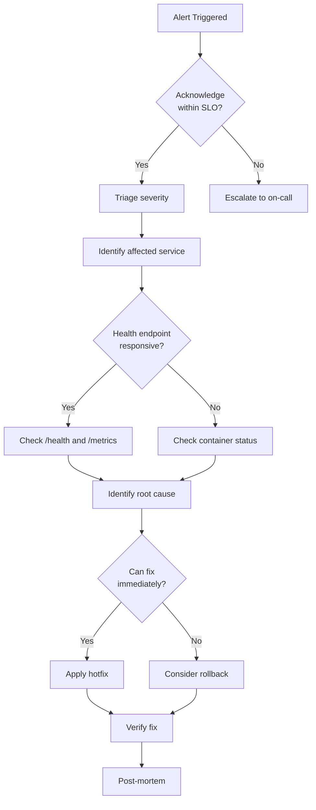

# Operations Runbook

## Incident Response

### Severity Levels

| Level | Definition | Response Time | Example |
|---|---|---|---|
| **SEV1** | Complete service outage | 15 min | API returning 5xx for all requests |
| **SEV2** | Major feature degraded | 1 hour | RAG search returning errors |
| **SEV3** | Minor issue, workaround available | 8 hours | Non-critical metric missing |
| **SEV4** | Cosmetic or informational | Next release | Documentation error |

### Incident Flow



## Failure Procedures

### Database Failure

**Symptoms:**
- `/api/v1/ready` returns unhealthy
- SQLAlchemy connection errors
- All CRUD operations fail

**Steps:**
```bash
# 1. Check PostgreSQL status
docker compose ps postgres
docker compose logs postgres --tail=50

# 2. Verify connection from API container
docker compose exec api python -c "
from apps.api.core.database import async_session
import asyncio
async def test():
    async with async_session() as s:
        await s.execute(text('SELECT 1'))
        print('Database OK')
asyncio.run(test())
"

# 3. If PostgreSQL is down, restart
docker compose restart postgres

# 4. If connection pool exhausted, restart API
docker compose restart api
```

**Rollback:**
```bash
# Rollback last migration
make migrate-downgrade
```

### Redis Failure

**Symptoms:**
- Health check shows Redis degraded
- WebSocket connections failing
- Session cache unavailable

**Impact:** Non-critical. Sessions fall through, WebSocket pub/sub degraded.

**Steps:**
```bash
docker compose restart redis
```

### Qdrant Failure

**Symptoms:**
- RAG search/ingest returning errors
- Health check shows Qdrant degraded

**Impact:** RAG functionality unavailable. Agent and workflow invocation still work.

**Steps:**
```bash
# Check Qdrant logs
docker compose logs qdrant --tail=50

# Restart if needed
docker compose restart qdrant
```

### LLM Provider Outage

**Symptoms:**
- Agent invocations failing with provider errors
- 401/429 from OpenAI/Anthropic/Google

**Steps:**
1. Check provider status page
2. Switch to alternative provider via `LLM_PROVIDER` env var
3. If API key issue, rotate key and update `.env`
4. Restart API to pick up new configuration

## Deployment Rollback

```bash
# 1. Revert to previous Docker image tag
docker compose -f docker-compose.prod.yml up -d api:previous-tag

# 2. Rollback database migration if needed
make migrate-downgrade

# 3. Verify health
curl http://localhost:8000/api/v1/health
```

## Monitoring Alerts

### Configured Alerts

| Alert | Condition | Severity |
|---|---|---|
| High Error Rate | >5% 5xx responses over 5 min | SEV2 |
| High Latency | p99 > 5s over 5 min | SEV3 |
| Database Down | Health check fails 3 consecutive | SEV1 |
| Redis Down | Health check fails 3 consecutive | SEV3 |
| Qdrant Down | Health check fails 3 consecutive | SEV3 |
| Rate Limit Saturation | >80% of limit used | SEV4 |
| Low Disk Space | <10% available on data volumes | SEV3 |

## Post-Mortem Template

```markdown
# Post-Mortem: [INCIDENT TITLE]

**Date:** YYYY-MM-DD
**Severity:** SEV1/SEV2/SEV3
**Duration:** X hours Y minutes
**Impact:** [Description of user impact]

## Timeline
- HH:MM - Alert triggered
- HH:MM - Engineer acknowledged
- HH:MM - Identified root cause
- HH:MM - Mitigation applied
- HH:MM - Service restored

## Root Cause
[Description]

## Resolution
[Steps taken]

## Preventative Measures
- [Action item 1]
- [Action item 2]

## Action Items
- [ ] Owner: Task
```
