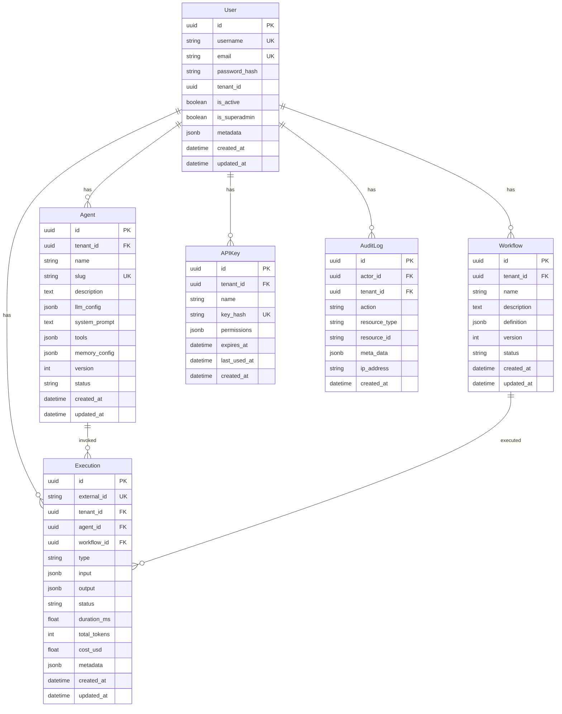
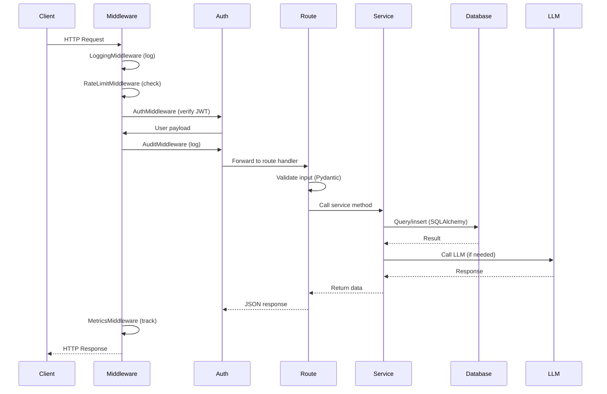

# System Design

## API Design

### Base URL
All API endpoints are prefixed with `/api/v1`.

### Authentication
- **JWT Bearer Tokens**: Access tokens (30 min) + Refresh tokens (7 days)
- **API Keys**: Hash-based authentication for programmatic access
- **Headers**: `Authorization: Bearer <token>` or `X-API-Key: <key>`

### Standard Responses

**Success:**
```json
{
  "id": "uuid",
  "name": "resource name",
  "created_at": "2025-01-01T00:00:00Z",
  ...
}
```

**Error:**
```json
{
  "error": "ERROR_CODE",
  "detail": "Human-readable message",
  "status_code": 400
}
```

**Paginated:**
```json
{
  "items": [...],
  "total": 100,
  "page": 1,
  "page_size": 20,
  "pages": 5
}
```

## Database Schema



## Request Flow



## Security Architecture

See [security.md](security.md) for detailed security documentation.

### Key Security Measures
- **JWT**: Signed with HS256, includes jti, exp, iss, aud claims
- **Password Hashing**: bcrypt with salt
- **API Keys**: SHA-256 hashed storage, never stored in plaintext
- **Expression Safety**: AST-based `safe_eval()` prevents arbitrary code execution
- **Rate Limiting**: Per-IP, per-route with configurable windows
- **Input Validation**: Pydantic schemas reject malformed data at boundary
- **Tenant Isolation**: All queries filtered by `tenant_id`
- **Audit Logging**: CRUD operations logged with actor, resource, timestamp

## Error Handling

```
Exception Hierarchy:
├── AppException (base)
│   ├── NotFoundException (404)
│   ├── AuthenticationException (401)
│   ├── RateLimitException (429)
│   └── ValidationException (422)
└── Exception (500 — generic fallback)
```

All exceptions are caught by global handlers in `register_exception_handlers()` and return structured JSON error responses.
