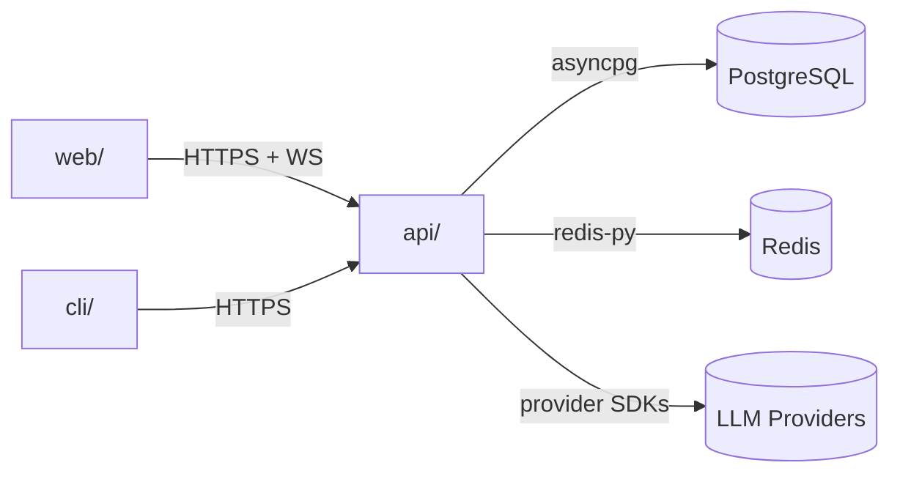

# `apps/` — Deployable Applications

This directory holds every deployable unit of AgentForge. Each subdirectory is
an independent package with its own README, dependency manifest, and tests.

## Contents

| Path | Type | Description |
|------|------|-------------|
| [`api/`](./api/README.md) | Backend | FastAPI service: agents, routes, jobs, integrations |
| [`web/`](./web/README.md) | Frontend | Next.js 15 App Router UI |
| [`cli/`](./cli/README.md) | Tooling | `agentforge` Python CLI for terminal + CI |

## Architecture

The three apps are loosely coupled — only `apps/api` is ever aware of the
database, LLM providers, and Redis. The web and CLI clients speak exclusively
over REST/WebSocket and have no service-to-service dependencies.

## Responsibilities

Each app is responsible for:

1. **Owning its own dependency manifest** (`requirements.txt` for `api`,
   `package.json` for `web`, `pyproject.toml` for `cli`).
2. **Self-contained tests** — co-located `tests/` folder.
3. **A self-describing `README.md`** with run instructions.
4. **Cross-app contracts** that live in `docs/api/API.md`.

## Do Not Place Here

- Cross-app libraries (move to a `packages/` workspace if a real one is added).
- Shared scripts that aren't tied to a specific deployable — put those in
  `scripts/` at the repo root instead.
- Marketing material, design docs, or PRDs (use `docs/`).

## Related Modules

- Root tooling: `Makefile`, `turbo.json`, `pnpm-workspace.yaml`.
- Shared types: not currently extracted; type duplication between FE/BE is
  tracked in `docs/development/CONVENTIONS.md`.
- CI workflows: `.github/workflows/` reference each app by path.