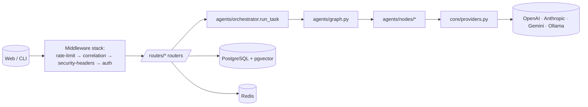

# `apps/api/` — FastAPI Backend

The AgentForge backend. Owns auth, agent orchestration, persistence, and all
external integrations (LLM providers, GitHub, observability).

## Purpose

- Expose the public REST + WebSocket API consumed by `apps/web` and `apps/cli`.
- Run the LangGraph agent workflows (`agents/`).
- Persist users, projects, teams, tasks, executions, memories, and feedback in
  PostgreSQL.
- Enforce auth, rate limiting, and prompt-injection defenses.
- Bridge to external integrations (GitHub App, LLM providers, observability).

## Contents

| Path | Purpose |
|------|---------|
| `app/main.py` | FastAPI entrypoint — middleware stack, lifespan, routers |
| `app/auth.py` | JWT auth middleware (Bearer access tokens) |
| `app/feedback_service.py` | User-feedback-driven pattern rejection |
| `app/file_parser.py` | Multi-language parser (used by repo context ingestion) |
| `app/memory_service.py` | pgvector-backed long-term memory |
| `app/integrations/` | External integrations (`github.py`) |
| `app/routes/` | REST routers: `auth`, `teams`, `tasks`, `executions`, `keys`, `review`, `projects`, `context`, `analytics`, `memories`, `feedback`, `github`, `health` |
| `agents/graph.py` | LangGraph `StateGraph` definition |
| `agents/orchestrator.py` | Drives a task through the graph (state, context, memory) |
| `agents/state.py` | Typed shape of agent state |
| `agents/sanitize.py` | Input sanitization (prompt-injection defenses) |
| `agents/nodes/` | One LangGraph node per file (`team_lead`, `builder`, `reviewer`, `security`, `tester`, `architect`, `aggregator`) |
| `agents/prompts/` | Jinja2 system prompts, one per node |
| `core/config.py` | Pydantic-settings configuration |
| `core/database.py` | `asyncpg` pool + migration runner |
| `core/redis.py` | Redis client + rate-limit helper |
| `core/providers.py` | Unified LLM provider abstraction |
| `core/model_registry.py` | Model capability registry |
| `core/encryption.py` | At-rest encryption helpers |
| `core/observability.py` | Prometheus metrics + correlation IDs |
| `core/logging_config.py` | Structured logging |
| `core/task_tracker.py` | Background task lifecycle |
| `core/validation.py` | Shared Pydantic validators |
| `models/schemas.py` | API request/response schemas |
| `models/agent_outputs.py` | Parsed agent-output Pydantic models |
| `migrations/` | Numbered SQL migrations (`001_initial.sql` … `017_github_integration.sql`) |
| `benchmarks/` | Benchmark runner, scorer, report generator |
| `evals/` | Eval harness + adversarial cases |
| `tests/` | pytest suite |
| `uploads/` | Runtime user-uploaded files (gitignored) |

## Architecture

See `docs/architecture/SYSTEM_ARCHITECTURE.md` for the full breakdown.

## Responsibilities

- Authenticate and authorize every request (JWT middleware).
- Validate request payloads via Pydantic (`models/schemas.py`).
- Stream agent execution via LangGraph.
- Persist state changes incrementally for resumability.
- Surface Prometheus metrics and JSON logs with correlation IDs.
- Apply rate limiting, brute-force protection, and prompt-injection sanitization.

## Do Not Place Here

- Static frontend assets — those belong in `apps/web`.
- Long-running CLI tools — those belong in `apps/cli`.
- Marketing, design, or business strategy docs — those belong in `docs/`.

## Related Modules

- Migrations live here and are applied automatically on startup
  (`pool.run_migrations()`).
- The CLI (`apps/cli`) and Web (`apps/web`) are its only consumers.
- Configuration: see `docs/development/ENV.md` for the full env-var reference.