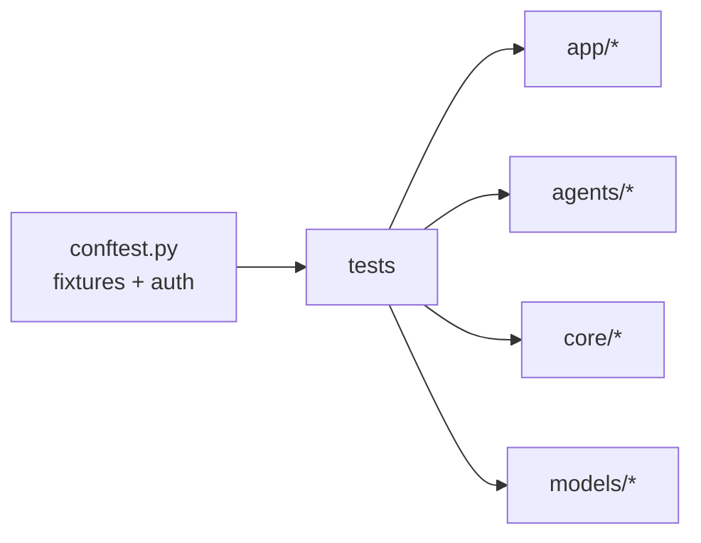

# `apps/api/tests/`

The pytest suite for the AgentForge backend.

## Purpose

Verify correctness, security, and behavior of:

- Route handlers (`test_*.py` mirroring `app/routes/`).
- Agent nodes (`test_graph.py`, `test_review.py`, `test_*_node.py` where
  applicable).
- Services (`test_memory_service.py`, `test_file_parser.py`,
  `test_feedback.py`).
- Cross-cutting concerns: `test_auth.py`, `test_security.py`,
  `test_prompt_injection.py`, `test_projects_authz.py`, `test_keys.py`.
- End-to-end (`test_e2e_full_flow.py`).
- Concurrency (`test_concurrency.py`).
- Performance (`test_review_load.py`).
- Provider contracts (`test_providers.py`).
- Task tracker (`test_task_tracker.py`).

## Running

```bash
make test
# or:
cd apps/api && pytest -v
```

## Architecture



## Responsibilities

- Provide fixture coverage for every public endpoint.
- Enforce security guarantees with explicit tests (prompt injection, authz,
  brute force).
- Catch regressions in graph behavior with `test_graph.py` and `test_review.py`.

## Do Not Place Here

- Frontend tests — those live with `apps/web`.
- Live integration tests against real LLM providers — use `pytest-httpx`
  mocks.
- Benchmark scripts — those live in `apps/api/benchmarks/`.

## Related Modules

- Implementation under test: `apps/api/`.
- Migrations exercised by tests: `apps/api/migrations/`.
- Conftest: `apps/api/tests/conftest.py` defines shared fixtures and
  auto-attaches JWT tokens to test clients.