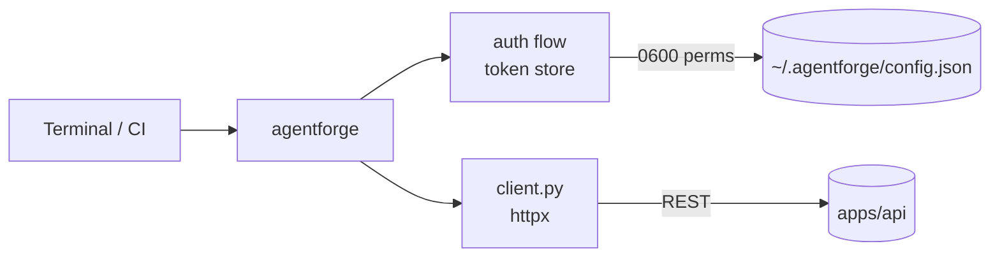

# `apps/cli/` — AgentForge CLI

The `agentforge` command-line interface. Lets developers and CI pipelines run
Quick Review, submit tasks, and check task status from the terminal.

## Contents

| Path | Purpose |
|------|---------|
| `agentforge_cli/__init__.py` | Package marker |
| `agentforge_cli/__main__.py` | `python -m agentforge_cli` entrypoint |
| `agentforge_cli/client.py` | HTTP client for the AgentForge API |
| `tests/test_cli.py` | CLI test suite |
| `pyproject.toml` | Packaging metadata (produces the `agentforge` console script) |

## Architecture

## Responsibilities

- Provide a scriptable surface over the public API.
- Persist credentials with restrictive permissions (`chmod 0600`).
- Auto-refresh access tokens on expiry using the stored refresh token.
- Exit non-zero when a review finds critical/high issues (CI-friendly).

## Do Not Place Here

- Long-running services — those belong in `apps/api/`.
- UI code — that belongs in `apps/web/`.
- Shared utilities used by both web and api — those should be lifted into a
  shared package.

## Related Modules

- API contract: `docs/api/API_REFERENCE.md`.
- Auth format: `apps/api/app/auth.py`.
- Quick Review route: `apps/api/app/routes/review.py`.