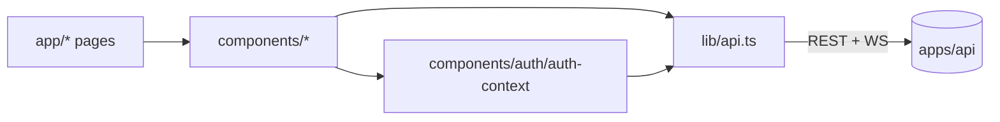

# `apps/web/` — Next.js 15 Frontend

The AgentForge web UI. Built with Next.js 15 (App Router), React 19, Tailwind
v4, and shadcn-style Radix primitives.

## Purpose

- Provide a polished UI for the Quick Review flow, team/task management, and
  live agent execution visualization.
- Authenticate against `apps/api` via JWT (auto-refresh on 401).
- Render streaming agent output and graph state in real time.

## Contents

| Path | Purpose |
|------|---------|
| `app/` | App Router pages: `dashboard`, `demo`, `tasks`, `teams`, `projects`, `executions`, `analytics`, `review`, `templates`, `settings`, `login`, `register`, `benchmark` |
| `components/` | React components — agent visualizations, layouts, form widgets |
| `components/ui/` | shadcn-style primitives (button, card, dialog, etc.) |
| `components/auth/` | Auth context provider (stores JWT + refresh tokens) |
| `lib/api.ts` | Typed API client with auto-refresh on 401 |
| `lib/types.ts` | Frontend↔backend type definitions |
| `lib/constants.ts` | Static UI constants |
| `lib/templates.ts` | Pre-built review/task templates |
| `lib/demo-data.ts` | Demo seed data |
| `lib/utils.ts` | `cn()`, formatting helpers |
| `next.config.ts` | Next.js config |
| `tsconfig.json` | TypeScript config (extends root) |
| `public/` | Static assets |
| `postcss.config.mjs` | Tailwind v4 PostCSS config |

## Architecture

## Responsibilities

- Render the full AgentForge UI.
- Persist JWT + refresh tokens in a non-HttpOnly fallback path (current dev
  behavior; production deployment should switch to HttpOnly cookies).
- Stream agent output to the user via polling on the executions endpoint.
- Provide UX primitives (sidebar, topbar, command palette, error boundary).

## Do Not Place Here

- Server-side business logic — all logic lives in `apps/api`.
- Long-running scripts — those belong in `apps/cli` or `scripts/`.
- API client logic for non-web targets — `apps/cli` has its own client.

## Related Modules

- Backend contract: `docs/api/API.md`.
- Style system: shadcn primitives in `components/ui/`.
- Auth: `apps/api/app/auth.py` defines the JWT format that this app consumes.