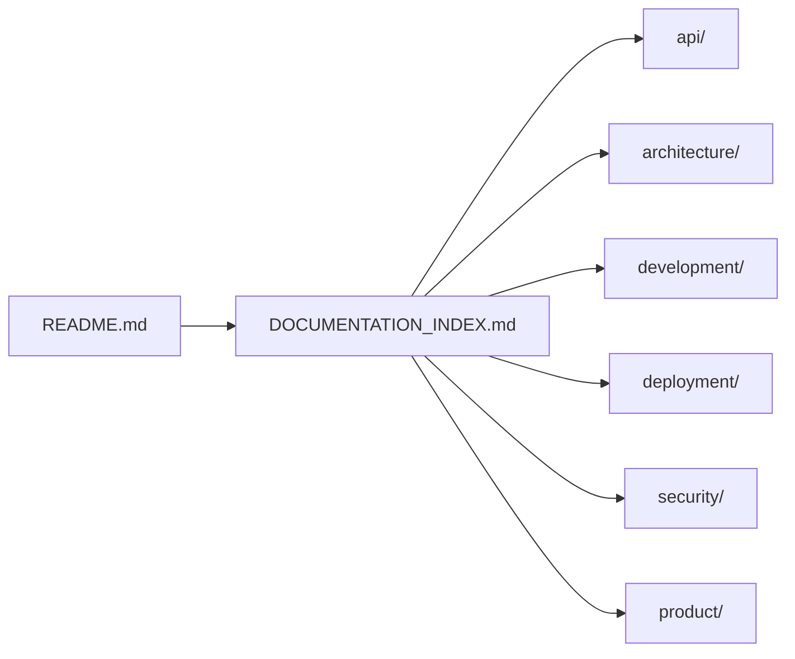

# `docs/` — AgentForge Documentation

This directory is the **single source of truth** for everything a developer,
operator, contributor, or evaluator needs to know about AgentForge.

## Contents

| Path | Audience | Purpose |
|------|----------|---------|
| [`README.md`](./README.md) | Everyone | This file — orientation |
| [`DOCUMENTATION_INDEX.md`](./DOCUMENTATION_INDEX.md) | Everyone | Status + reading order for every doc |
| [`CHANGELOG.md`](./CHANGELOG.md) | Everyone | Public change log |
| [`TERMS_OF_USE.md`](./TERMS_OF_USE.md) | Users + Legal | Terms |
| [`api/`](./api/README.md) | Integrators | REST + WebSocket reference |
| [`architecture/`](./architecture/README.md) | Engineers | System architecture, schema, agents, prompts |
| [`development/`](./development/README.md) | Contributors | Onboarding, conventions, env, testing, decisions |
| [`deployment/`](./deployment/README.md) | Operators | Deployment, CI/CD, scaling |
| [`security/`](./security/README.md) | Engineers + Security | Security model, incident runbook, data privacy |
| [`product/`](./product/README.md) | Product / GTM | PRD, pricing, roadmap, strategy |

## Architecture

## Responsibilities

- Curate **active** documentation only. Anything stale lives in `../archive/`.
- Provide a clear entry point per audience (engineer, operator, contributor).
- Cross-link aggressively so a reader never has to guess where to go next.
- Stay version-controlled with the codebase so doc drift is visible.

## Do Not Place Here

- Code, configuration, or scripts — those belong under `apps/`.
- One-off audit outputs or strategy drafts — those belong in `../archive/`.
- Auto-generated API reference (build that from OpenAPI into `docs/api/`).

## How to Add a New Doc

1. Pick the audience-specific subfolder (`architecture/`, `development/`,
   `deployment/`, `security/`, `product/`, `api/`).
2. Cross-link from the parent README in that folder.
3. Update `DOCUMENTATION_INDEX.md` with status + audience + reading order.
4. If the doc supersedes another, mark the prior doc `Deprecated` and link to
   the replacement.