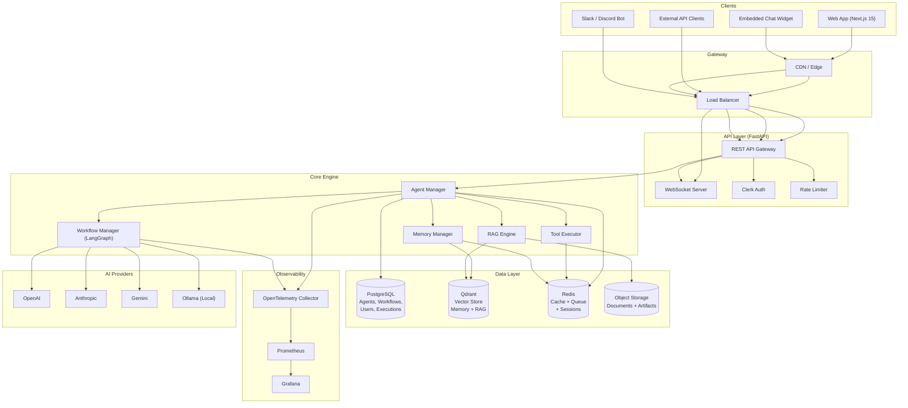
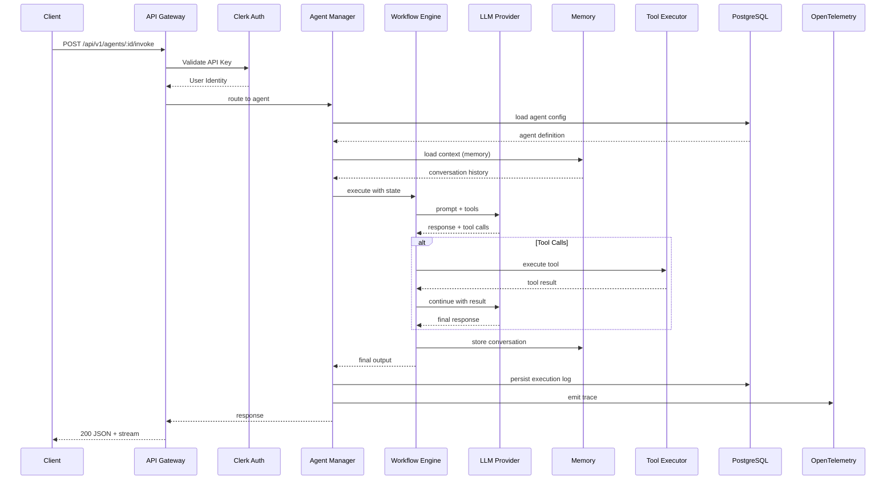
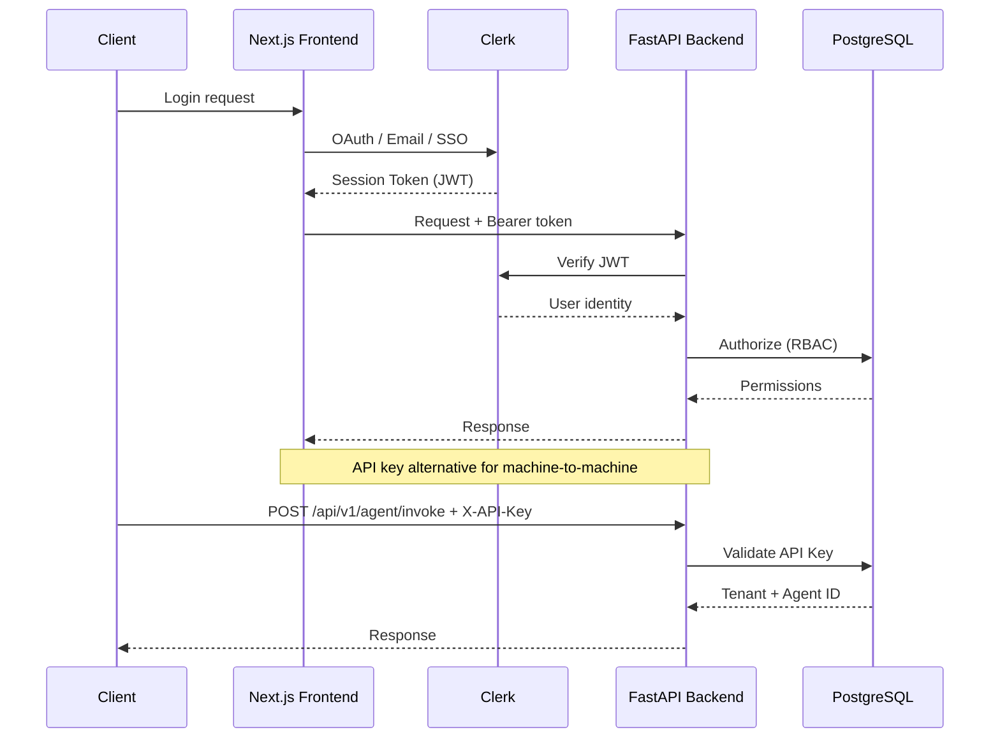
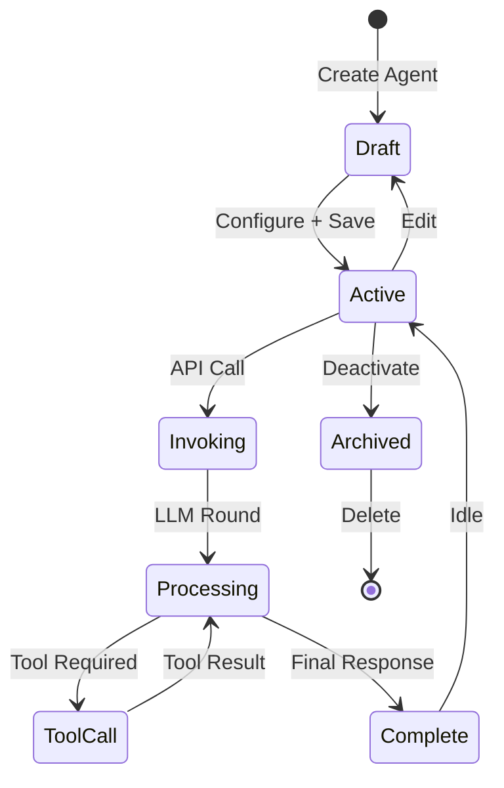
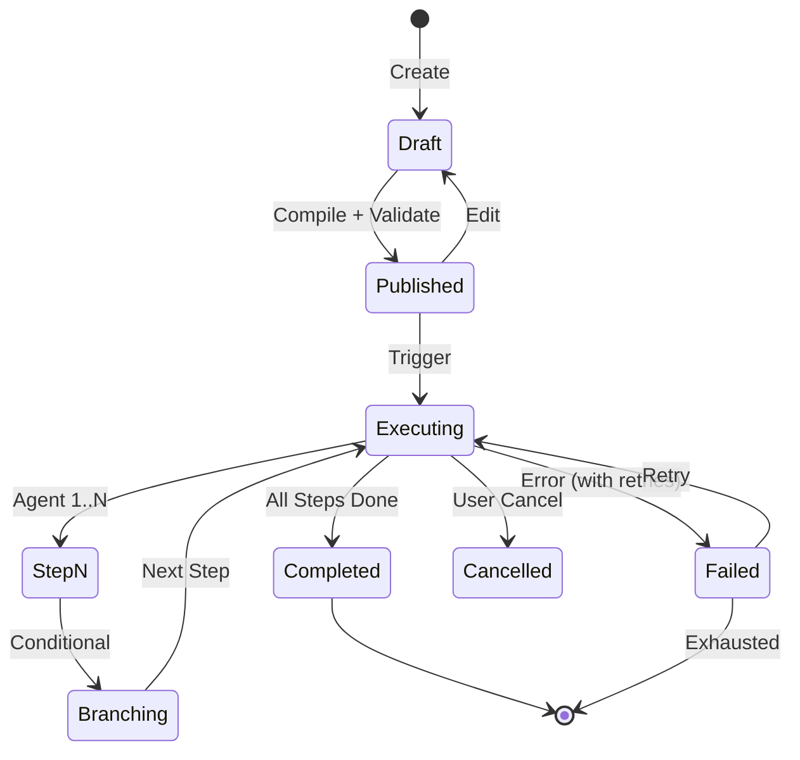

# AgentForge AI — Architecture

## High Level Architecture



## Request Flow



## Authentication Flow



## Agent Lifecycle



## Workflow Lifecycle



## Directory Structure (Conceptual)

```
agentforge/
├── apps/
│   ├── web/                  # Next.js 15 frontend
│   └── api/                  # FastAPI backend
├── packages/
│   ├── agents/               # Agent runtime & abstractions
│   ├── workflows/            # LangGraph workflow definitions
│   ├── tools/                # Tool implementations
│   ├── memory/               # Memory backends
│   ├── rag/                  # RAG pipeline
│   ├── llm/                  # LLM provider abstractions
│   ├── observability/        # OpenTelemetry setup
│   └── shared/               # Shared types & utilities
├── infrastructure/
│   ├── docker/               # Dockerfiles
│   ├── terraform/            # Infrastructure as Code
│   └── kubernetes/           # K8s manifests
├── tests/
│   ├── unit/
│   ├── integration/
│   └── e2e/
├── docs/
│   ├── adr/
│   ├── guides/
│   └── api/
├── scripts/
│   ├── setup.sh
│   └── seed.sh
├── .github/
│   ├── workflows/
│   ├── ISSUE_TEMPLATE/
│   └── PULL_REQUEST_TEMPLATE/
├── docker-compose.yml
├── Makefile
└── README.md
```

## Key Design Decisions

| Decision | Choice | Rationale |
|----------|--------|-----------|
| Monorepo | Turborepo | Shared types, unified CI, easier refactoring |
| API Framework | FastAPI | Async-native, auto-docs, Python ecosystem |
| Database | PostgreSQL | Reliability, JSON support, pgvector for embeddings |
| Vector Store | Qdrant | High-performance, self-hostable, gRPC API |
| Workflow Engine | LangGraph | State graphs, checkpointing, built for agents |
| Auth | Clerk | Managed auth, multi-provider, webhook support |
| Frontend | Next.js 15 | App Router, React 19, SSR, Server Actions |
| Observability | OpenTelemetry | Vendor-neutral, wide adoption, rich exporters |
