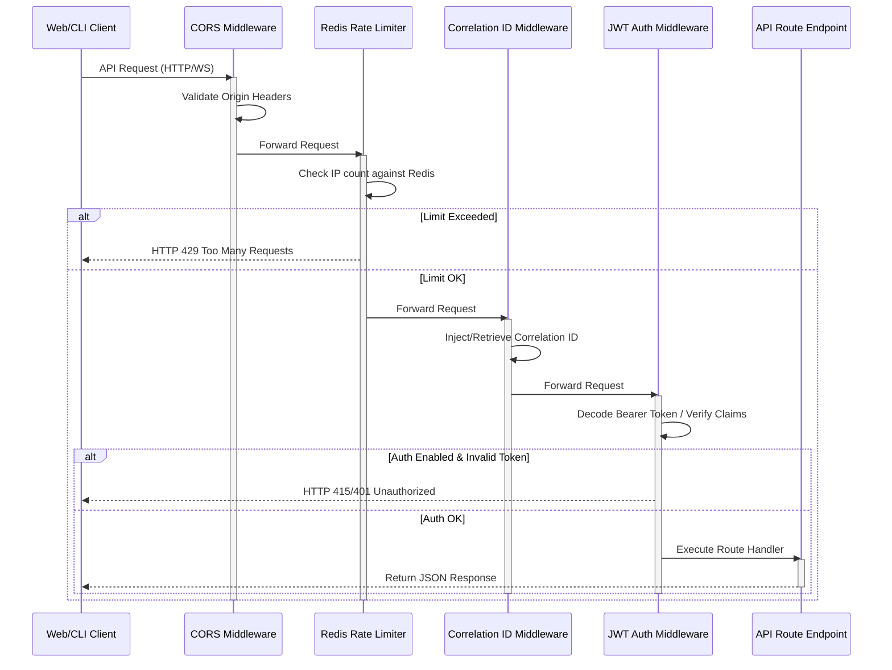
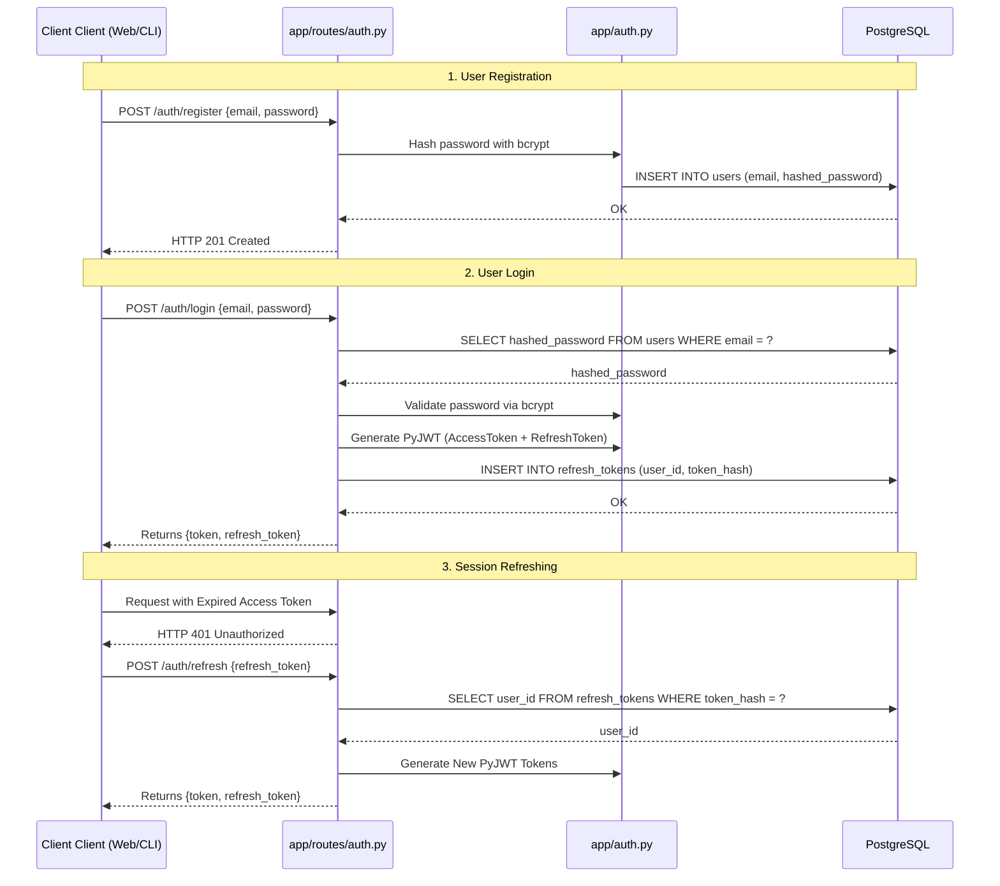
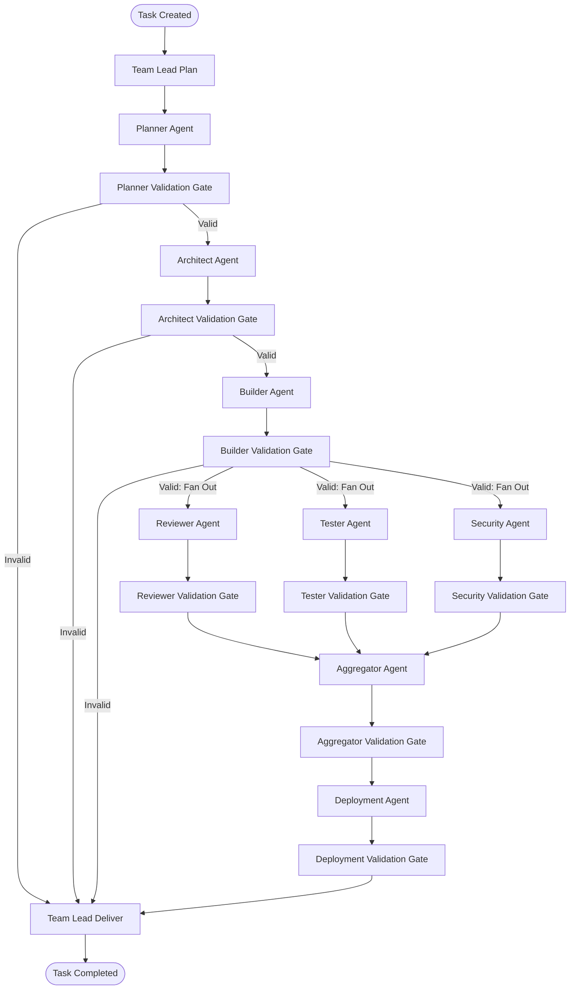
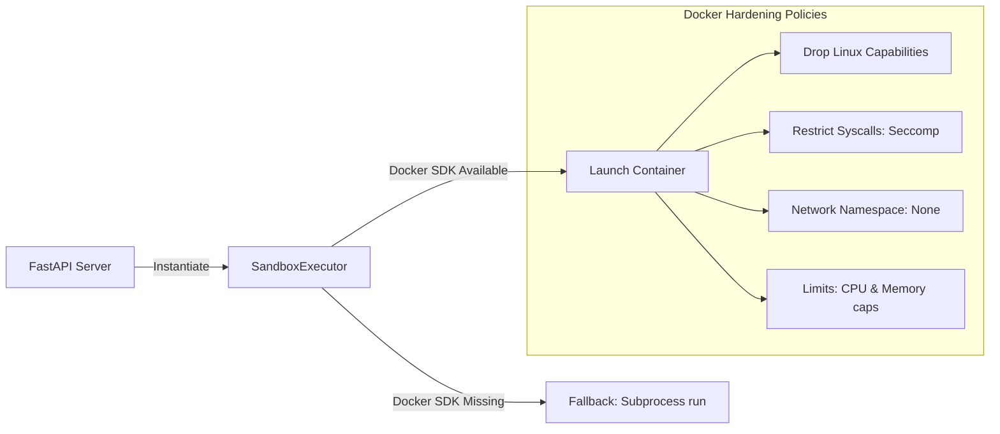
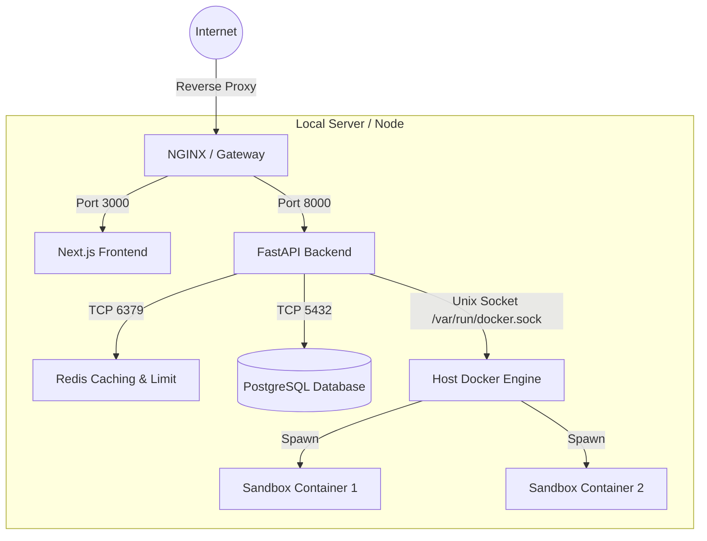

# System Architecture Blueprint — V1

This document outlines the actual system design, data routing pipelines, and component relationships implemented in AgentForge.

---

## 1. Request Lifecycle Flow

---

## 2. Authentication and Session Flow

---

## 3. Orchestration Engine State Flow

AgentForge coordinates executions using a LangGraph workspace layout:

---

## 4. Execution Sandbox Isolation

The `sandbox_executor.py` runs untrusted Builder outputs:

---

## 5. Deployment Topology

