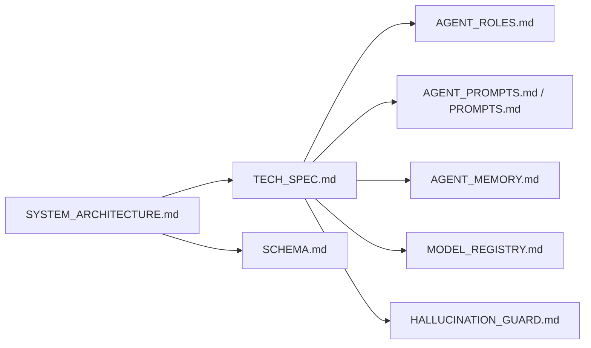

# `docs/architecture/`

Architecture-level documentation. The deeper "how it works" material that
engineers and integrators need.

## Contents

| Doc | Purpose |
|-----|---------|
| [`SYSTEM_ARCHITECTURE.md`](./SYSTEM_ARCHITECTURE.md) | Frontend / backend / agent / memory / auth / GitHub integration architecture (Mermaid diagrams) |
| [`TECH_SPEC.md`](./TECH_SPEC.md) | Technical specification — full system behavior |
| [`SCHEMA.md`](./SCHEMA.md) | Database schema + ER diagram |
| [`AGENT_ROLES.md`](./AGENT_ROLES.md) | Roles the agent graph can assume |
| [`AGENT_PROMPTS.md`](./AGENT_PROMPTS.md) | Prompt catalogue |
| [`PROMPTS.md`](./PROMPTS.md) | Prompt-engineering conventions |
| [`AGENT_MEMORY.md`](./AGENT_MEMORY.md) | Long-term memory model (pgvector) |
| [`MODEL_REGISTRY.md`](./MODEL_REGISTRY.md) | Supported LLM providers and models |
| [`HALLUCINATION_GUARD.md`](./HALLUCINATION_GUARD.md) | Defenses against agent hallucinations |

## Architecture

## Responsibilities

- Describe the **as-built** architecture, not aspirations.
- Keep Mermaid diagrams in sync with the code; if you rename a module, update
  the diagrams in the same PR.
- Capture cross-cutting concerns (auth, prompt-injection, memory) in dedicated
  docs that are easy to link to.

## Do Not Place Here

- API endpoints — those belong in `docs/api/`.
- Deployment or operations runbooks — those belong in `docs/deployment/` or
  `docs/security/INCIDENT_RUNBOOK.md`.
- Strategic/PMF material — that belongs in `docs/product/`.

## Related Modules

- Implementation: `apps/api/`, `apps/web/`.
- Migrations referenced by `SCHEMA.md` live in `apps/api/migrations/`.
- Test coverage of each node is in `apps/api/tests/`.