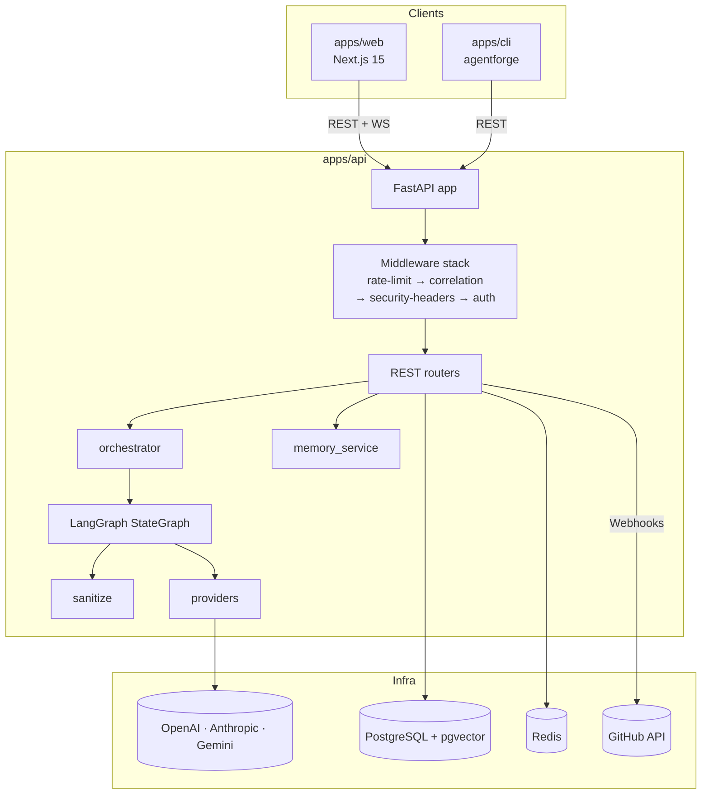
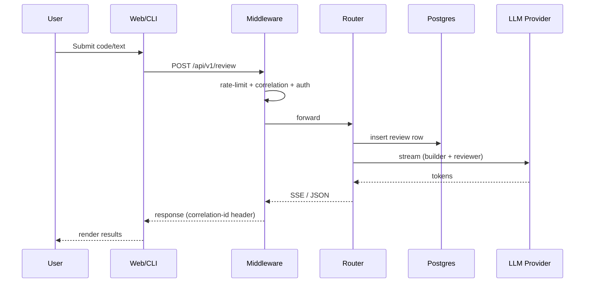
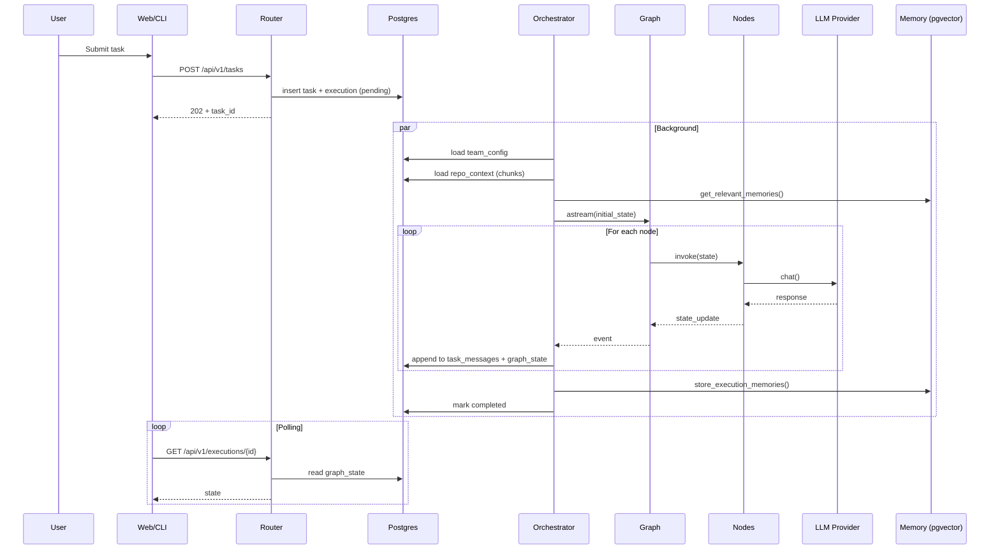
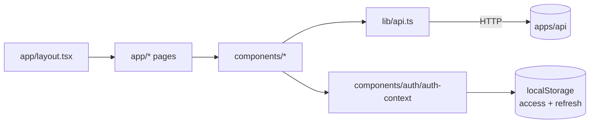
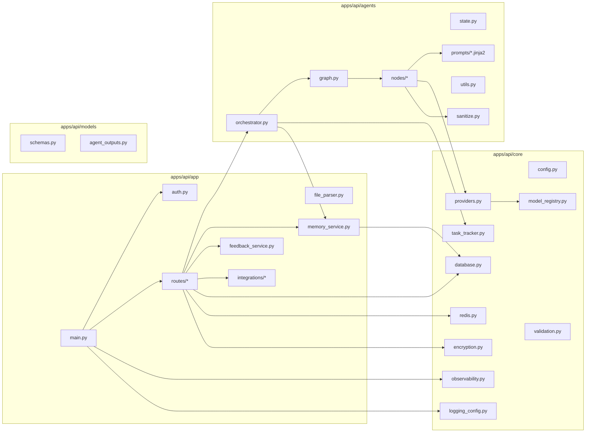
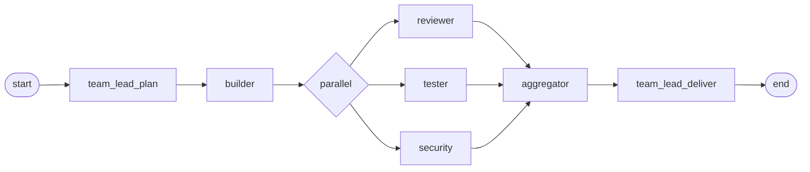
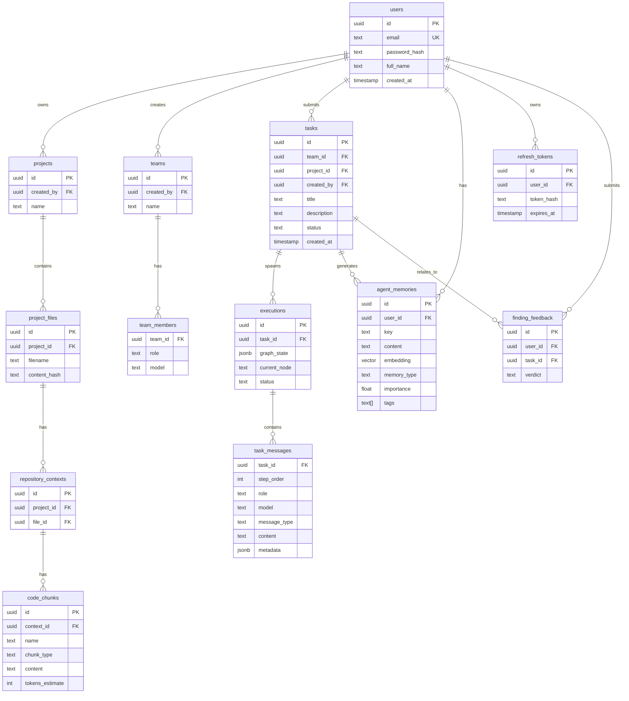
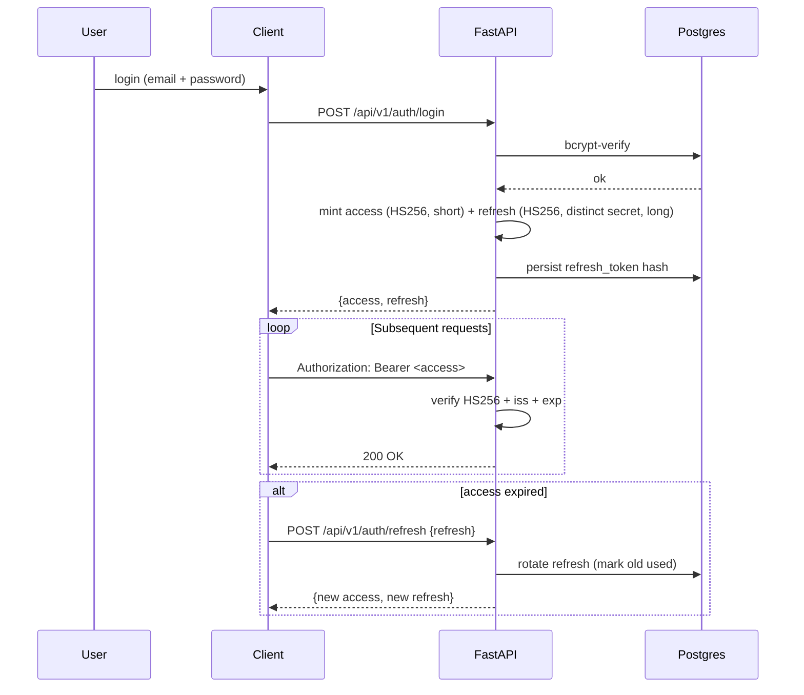
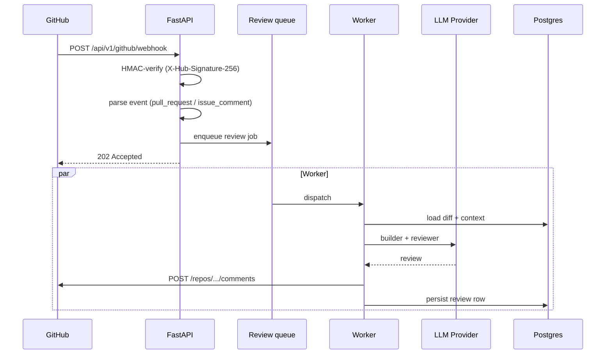

# System Architecture

End-to-end architectural reference for AgentForge. Read this if you are
onboarding, writing a non-trivial PR, or preparing for a security/architecture
review.

> **Audience:** Engineers, integrators, security reviewers.
> **Scope:** As-built behavior, not aspirations.

---

## Table of Contents

1. [System Overview](#1-system-overview)
2. [Frontend Architecture](#2-frontend-architecture)
3. [Backend Architecture](#3-backend-architecture)
4. [Agent Architecture](#4-agent-architecture)
5. [Memory Architecture](#5-memory-architecture)
6. [Database Architecture](#6-database-architecture)
7. [Authentication Architecture](#7-authentication-architecture)
8. [GitHub Integration Architecture](#8-github-integration-architecture)
9. [Cross-Cutting Concerns](#9-cross-cutting-concerns)

---

## 1. System Overview

AgentForge is a single FastAPI backend (`apps/api`) that fronts a PostgreSQL +
pgvector store, Redis, several LLM providers, and a GitHub App. Two thin
clients — a Next.js web app (`apps/web`) and a Python CLI (`apps/cli`) —
communicate exclusively via REST/WebSocket.



### Request lifecycle (Quick Review)



### Request lifecycle (Team Task)



---

## 2. Frontend Architecture

Stack: **Next.js 15** (App Router) + **React 19** + **TypeScript** + **Tailwind
v4** + **Radix UI** + **Framer Motion**.



### Pages

| Route | Purpose |
|-------|---------|
| `/` (landing) | Quick Review entry point |
| `/dashboard` | At-a-glance metrics + recent activity |
| `/teams` | Configure teams (members, models) |
| `/tasks`, `/tasks/[id]` | Submit + monitor tasks |
| `/executions/[id]` | Live graph viewer + per-message log |
| `/projects`, `/projects/[id]` | Upload files; manage project context |
| `/analytics` | Aggregate execution analytics |
| `/review` | File-level quick review |
| `/benchmark` | Run + view benchmark results |
| `/templates` | Manage review/task templates |
| `/settings` | API keys, model preferences |
| `/login`, `/register` | Auth |

### Key components

- `components/agent-network.tsx`, `components/execution-graph.tsx` — graph
  visualizations.
- `components/memory-viewer.tsx`, `components/context-viewer.tsx` — RAG
  inspection.
- `components/QuickReviewTextarea.tsx`,
  `components/QuickReviewProgress.tsx`,
  `components/QuickReviewResults.tsx` — Quick Review UX.
- `components/sidebar.tsx`, `components/topbar.tsx`,
  `components/command-palette.tsx` — layout + nav.
- `components/error-boundary.tsx` — global error fallback.

### Data flow

1. User action → page client component.
2. Component calls `lib/api.ts` (typed wrapper around `fetch`).
3. `lib/api.ts` auto-attaches the Bearer token and, on `401`, calls the
   refresh endpoint once before retrying.
4. Responses are streamed where appropriate (SSE) or polled (executions).

---

## 3. Backend Architecture

Stack: **FastAPI** + **Pydantic v2** + **asyncpg** + **redis-py** +
**LangGraph** + **httpx** (for LLM providers).



### Middleware stack (order matters)

1. **CORS** (FastAPI built-in).
2. `correlation_middleware` — assign/propagate `X-Correlation-ID`.
3. `rate_limit_middleware` — per-IP Redis-backed sliding window.
4. `security_headers_middleware` — `X-Content-Type-Options`, `X-Frame-Options`,
   HSTS, etc.
5. `auth_middleware` — verify Bearer JWT, attach `request.state.user`.

### Router map

| Path prefix | Router | Purpose |
|-------------|--------|---------|
| `/api/v1/auth` | `auth.py` | register, login, refresh, logout |
| `/api/v1/health` | `health.py` | liveness/readiness |
| `/api/v1/teams` | `teams.py` | CRUD teams + members |
| `/api/v1/tasks` | `tasks.py` | create/list/get tasks |
| `/api/v1/executions` | `executions.py` | execution status + graph state |
| `/api/v1/keys` | `keys.py` | user BYOK key management (encrypted) |
| `/api/v1/review` | `review.py` | quick review (queue + worker) |
| `/api/v1/projects` | `projects.py` | project CRUD, file uploads |
| `/api/v1/context` | `context.py` | repository context queries |
| `/api/v1/analytics` | `analytics.py` | rollups + time series |
| `/api/v1/memories` | `memories.py` | list/inspect memories |
| `/api/v1/feedback` | `feedback.py` | accept/dismiss findings |
| `/api/v1/github` | `github.py` | GitHub App webhooks + bot actions |
| `/api/v1/metrics` | (in `main.py`) | Prometheus exposition |

---

## 4. Agent Architecture

The core unit of value: a LangGraph `StateGraph` that orchestrates a team of
agents through a task.



In **fast demo mode** the graph is reduced to a single pass:

```
team_lead_plan → builder → reviewer → team_lead_deliver
```

### State

Defined in `apps/api/agents/state.py` — a typed dict (TypedDict) carrying:

```python
{
  "task": {"id", "title", "description"},
  "team_config": {role: {model, role}},
  "plan": Optional[str],
  "builder_output": Optional[str],
  "review": Optional[str],          # JSON findings
  "delivery": Optional[str],
  "current_step": str,
  "messages": List[Dict],            # per-node messages
  "errors": List[str],
  "fast_demo_mode": bool,
  "timed_out_agents": List[str],
  "repository_context": str,
  "relevant_memories": List[Dict],
  "learned_signal": str,             # feedback-driven bias for reviewer
}
```

### Nodes

| File | Role | Input | Output |
|------|------|-------|--------|
| `team_lead_node.py` | Team Lead (plan) | task, context, memories | JSON plan |
| `builder_node.py` | Builder | plan, context | code + summary |
| `reviewer_node.py` | Reviewer | builder output, learned_signal | PASS/FAIL + findings |
| `tester_node.py` | Tester | builder output | test cases + status |
| `security_node.py` | Security | builder output | security findings |
| `aggregator_node.py` | Aggregator | reviewer + tester + security | merged report |
| `team_lead_node.py` | Team Lead (deliver) | aggregated report | delivery summary |
| `architect_node.py` | Architect | task | architectural plan (optional) |

Each node is a standalone `async def node(state) -> state` function that:

1. Calls the appropriate LLM via `core/providers.py` with a timeout from
   `settings.agent_timeout`.
2. Validates output via `models/agent_outputs.py`.
3. Emits structured `messages` for the UI + DB.
4. Returns an incremental state update.

### Prompts

All prompts live in `apps/api/agents/prompts/` as Jinja2 templates. They are
loaded once and cached; a version comment lives in each file (see
`docs/architecture/PROMPTS.md` for the catalog and conventions).

### Sanitization

`agents/sanitize.py` is applied to every user-supplied field that reaches an
agent (file uploads, task descriptions, memories). It strips / escapes known
prompt-injection patterns and bounds input size.

---

## 5. Memory Architecture

AgentForge uses **pgvector** for long-term semantic memory.

```mermaid
graph LR
  Task[Completed task] --> Extract[Extract plan/code/review/delivery]
  Extract --> Embed[Embedding model]
  Embed --> PG[(agent_memories<br/>vector(1536))]
  NewTask[New task] --> Query[get_relevant_memories]
  Query --> Embed
  Query --> PG
  Query --> TopK[Top-k memories]
  TopK --> Inject[Inject into team_lead prompt]
```

- **Embedding model:** defaults to OpenAI `text-embedding-3-small`. Configurable
  per-provider in `core/config.py`.
- **Importance:** integer 0–1; stored alongside the embedding.
- **Tags:** arbitrary labels used for filtering.
- **Tenant isolation:** every query filters by `user_id` (and `project_id`
  when supplied).

See `docs/agents/AGENT_SYSTEM.md` for the full model and tuning guide.

---

## 6. Database Architecture

**PostgreSQL 16** with **pgvector** extension.



Migrations live in `apps/api/migrations/` and are applied alphabetically on
startup. Schema reference: [`docs/architecture/SCHEMA.md`](./SCHEMA.md).

---

## 7. Authentication Architecture



Key properties:

- **Two secrets, never shared** (`AGENTFORGE_JWT_SECRET` ≠
  `AGENTFORGE_JWT_REFRESH_SECRET`). This prevents an access token from being
  replayed as a refresh token (TOP_FINDINGS #7).
- **bcrypt** with cost factor ≥ 12 for password storage.
- **Brute-force lockout** on auth endpoints.
- **Refresh tokens are rotated** and the previous hash invalidated on use.
- **Tenant isolation**: every query that returns user data filters by
  `created_by = current_user.id`.

See [`docs/security/SECURITY_MODEL.md`](../security/SECURITY_MODEL.md) for the
full threat model.

---

## 8. GitHub Integration Architecture

The GitHub App watches PRs and posts multi-agent reviews as comments.



- **Auth:** GitHub App JWT signed with the private key from
  `AGENTFORGE_GITHUB_APP_PRIVATE_KEY`. The app's installation token is cached
  in Redis with TTL < GitHub's expiry.
- **Webhook security:** HMAC SHA-256 with `AGENTFORGE_GITHUB_WEBHOOK_SECRET`.
- **Rate limits:** respected with a token-bucket per installation.
- **Idempotency:** events keyed by delivery ID.

---

## 9. Cross-Cutting Concerns

### Observability

- **Logs:** structured JSON via `core/logging_config.py`. Correlation ID
  (`X-Correlation-ID`) is auto-propagated.
- **Metrics:** `GET /api/v1/metrics` exposes Prometheus text. Includes
  request count by status, duration distribution, and active background
  task gauge.
- **Tracing:** hooks in middleware, easy to wire OTel later.

### Rate limiting

Per-IP sliding window in Redis with separate budgets for:

- Global API (`rate_limit_per_minute`).
- Auth endpoints (`rate_limit_auth_per_minute`).

Auth endpoints additionally apply brute-force lockout
(`brute_force_max_attempts`, `brute_force_lockout_seconds`).

### Configuration

Everything is environment-driven via `core/config.py` (Pydantic Settings). The
single source of truth is `apps/api/.env.example`; see
[`docs/getting-started/SETUP.md`](../getting-started/SETUP.md) for the annotated
reference.

### Deployment

See [`docs/deployment/DEPLOYMENT.md`](../deployment/DEPLOYMENT.md). Image is
built from the root `Dockerfile`; migrations run automatically on startup.
