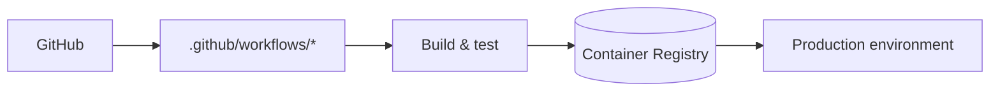

# `docs/deployment/`

How AgentForge ships: CI/CD, infrastructure, scaling, and production readiness.

## Contents

| Doc | Audience | Purpose |
|-----|----------|---------|
| [`DEPLOYMENT.md`](./DEPLOYMENT.md) | Operators | Deploy API + Web + CLI; environment, secrets, scaling |

## Architecture

## Responsibilities

- Be the canonical source for production deployment steps.
- Document environment-specific configuration (dev vs staging vs prod).
- Cover rollback, scaling, and observability hooks.

## Do Not Place Here

- Day-2 operational incident handling — that belongs in
  `docs/security/INCIDENT_RUNBOOK.md`.
- Local-only developer setup — that's in `docs/development/`.
- API surface details — `docs/api/API.md`.

## Related Modules

- Container image: `Dockerfile` (root).
- Local stack: `docker-compose.yml` (root).
- Secrets reference: `docs/development/ENV.md`.