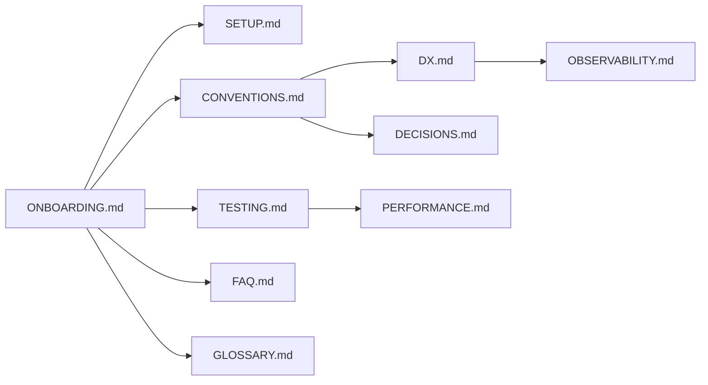

# `docs/development/`

Everything a contributor needs to be productive: onboarding, conventions,
environment, testing, performance, observability, FAQ, and decision history.

## Contents

| Doc | Audience | Purpose |
|-----|----------|---------|
| [`ONBOARDING.md`](./ONBOARDING.md) | New contributors | 30-minute productivity path |
| [`SETUP.md`](./SETUP.md) | New contributors | Environment setup |
| [`TESTING.md`](./TESTING.md) | Engineers | Test layout, how to run, how to add tests |
| [`CONVENTIONS.md`](./CONVENTIONS.md) | Engineers | Code style, naming, forbidden patterns |
| [`DX.md`](./DX.md) | Engineers | Developer-experience expectations and tooling |
| [`ENV.md`](./ENV.md) | Engineers + Ops | Environment variables reference |
| [`PERFORMANCE.md`](./PERFORMANCE.md) | Engineers | Performance budgets and profiling |
| [`OBSERVABILITY.md`](./OBSERVABILITY.md) | Engineers + Ops | Logging, metrics, tracing |
| [`DECISIONS.md`](./DECISIONS.md) | Engineers | Architecture Decision Records (ADRs) |
| [`FAQ.md`](./FAQ.md) | Everyone | Frequently asked questions |
| [`GLOSSARY.md`](./GLOSSARY.md) | Everyone | Domain terms and abbreviations |
| [`CONTRIBUTING.md`](./CONTRIBUTING.md) | Contributors | How to file PRs / issues |
| [`CLAUDE.md`](./CLAUDE.md) | Claude Code sessions | Conventions for Claude Code in this repo |
| [`AUDIT.md`](./AUDIT.md) | Engineers | Repository audit notes |
| [`BUGS.md`](./BUGS.md) | Engineers | Known bugs and their status |

## Architecture

## Responsibilities

- Make a fresh contributor productive in under 30 minutes.
- Document every convention with a code example.
- Capture "why" decisions, not just "what."

## Do Not Place Here

- Production deployment steps — `docs/deployment/`.
- Threat modeling or security policy — `docs/security/`.
- Marketing/PR — `docs/product/`.

## Related Modules

- Code under change: `apps/`.
- CI definitions: `.github/workflows/`.
- Environment defaults: `apps/api/.env.example`.