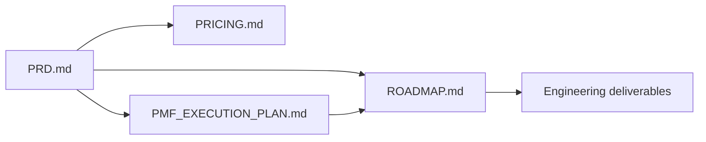

# `docs/product/`

Product strategy and positioning material. Intended for internal PMs, GTM,
investors, and reviewers — not part of the runtime contract.

## Contents

| Doc | Audience | Purpose |
|-----|----------|---------|
| [`PRD.md`](./PRD.md) | Product | Product requirements and vision |
| [`ROADMAP.md`](./ROADMAP.md) | Product + Eng | Forward-looking plan |
| [`PRICING.md`](./PRICING.md) | GTM | Pricing tiers and packaging |
| [`PMF_EXECUTION_PLAN.md`](./PMF_EXECUTION_PLAN.md) | Founders | Product-market-fit workplan |
| [`PROJECT_CONTEXT.md`](./PROJECT_CONTEXT.md) | Everyone | High-level project context |

## Architecture

## Responsibilities

- Capture **why** AgentForge exists and what we're building toward.
- Stay grounded — every claim in this folder should be backed by data, the
  roadmap, or an explicit hypothesis.

## Do Not Place Here

- Engineering specs — `docs/architecture/` and `docs/development/`.
- Security or compliance claims — `docs/security/`.
- Code, config, or scripts.

## Related Modules

- Engineering: `docs/architecture/SYSTEM_ARCHITECTURE.md`.
- Delivery: `docs/development/ONBOARDING.md` and the issues tracker.