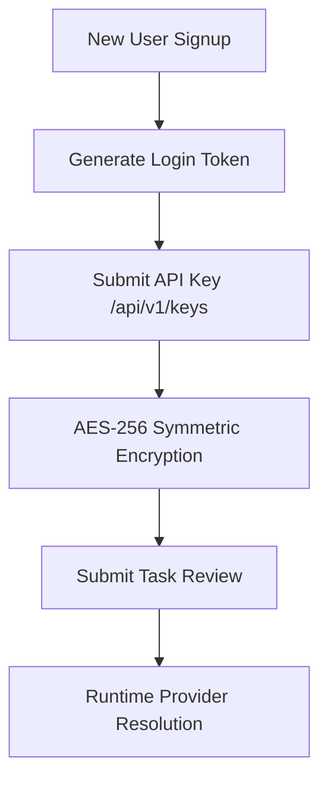

# 🔑 BYOK Onboarding Walkthrough — AgentForge V1.0.0

This report details the walkthrough of the Bring-Your-Own-Key (BYOK) credential lifecycle and onboarding experience.

---

## 📋 1. Onboarding Lifecycle

A new user can onboard and run reviews entirely locally without central administrative intervention:

### Onboarding Steps:
1. **Signup & Session Creation:** Users signup via `/api/v1/auth/signup` (password is hashed using `bcrypt`) and authenticate to obtain a JWT token.
2. **Adding Provider Keys:** Users add a key using `POST /api/v1/keys`. The key is validated in two stages:
   * **Format check:** Validated against standard regex matches in [core/validation.py](file:///c:/Users/garvi/AgentForge/apps/api/core/validation.py#L44-L57).
   * **Live check:** Tested via `validate_key_live` making an ephemeral ping request to the provider's API.
3. **Encryption at Rest:** Verified that keys are symmetrically encrypted at rest using AES-256 Fernet keys in [core/encryption.py](file:///c:/Users/garvi/AgentForge/apps/api/core/encryption.py).
4. **Provider Resolution:** Submitting a review or executing a task dynamically resolves the user's encrypted key inside `get_user_api_key` in [app/routes/keys.py](file:///c:/Users/garvi/AgentForge/apps/api/app/routes/keys.py#L58-L82).

---

## 🛡️ 2. Key Error & Failure Handling

We audited the backend response logic under various key failure scenarios:

| Failure Scenario | Backend Response | HTTP Status |
|:---|:---|:---:|
| **Missing Key** | Bypasses to system default key in `.env` if available; otherwise raises `AIProviderError` | `400` / `500` |
| **Invalid Key Format** | Rejected by format validators | `422 Unprocessable Entity` |
| **Revoked/Incorrect Key** | Caught by live validator ping before saving | `400 Bad Request` |

---

## 🏆 3. Audit Verdict

**GO (Release)**
* *Robust Key Lifecycle:* Key validation, storage, and retrieval flows are secure and decoupled from third-party services.
* *Onboarding is Self-contained:* Users can run the CLI or visual dashboards immediately without global credential access.
