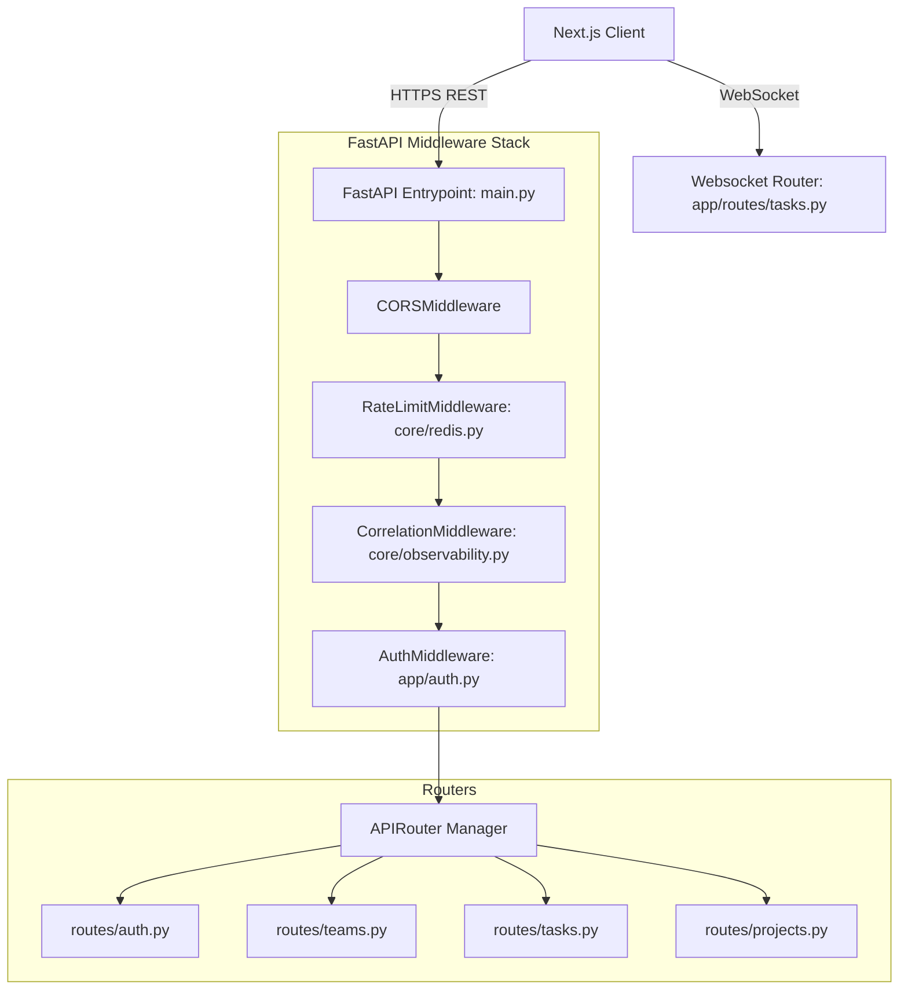
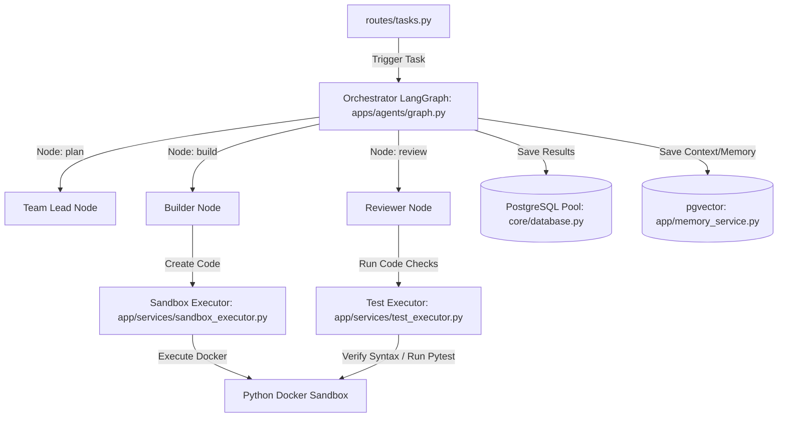
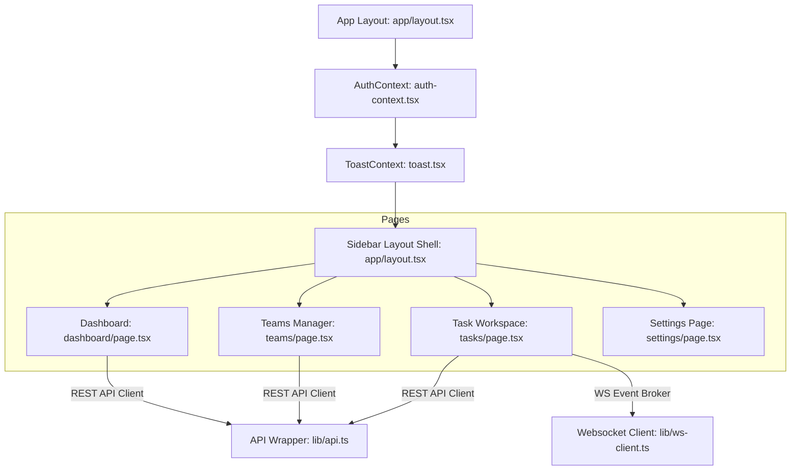

# Repository Forensics

`Version: 1.0` · `Scope: Full-Stack Source & Dependency Telemetry`

This document outlines the structural truth of the AgentForge repository, generated via recursive code inventory scanning. All metrics are validated against current file pathways, imports, and decorators.

---

## 1. Code Statistics

| Category | Count | Scope / Details |
| :--- | :--- | :--- |
| **Total Files** | **774** | Excluding virtual environments (`venv`, `.venv`), `node_modules`, `.git`, `.next`, and build caches. |
| **Total Source Files** | **526** | Total files containing logic: **449** Python, **76** TypeScript/React, **1** CSS. |
| **Total Source Lines** | **~64,000** | Across Python application modules and frontend pages/components. |
| **Total Test Files** | **35** | Python unit/E2E test suites inside `apps/api/tests/` and `apps/cli/tests/`. |
| **Total API Endpoints** | **82** | Documented FastAPI route paths (`@router.<method>`) across 14 router modules. |
| **Total UI Pages** | **20** | Next.js App Router route entry pages (`page.tsx`) or API handlers (`route.ts`). |
| **Total DB Migrations** | **22** | Incremental SQL migration scripts inside `apps/api/migrations/`. |
| **Total DB Tables** | **30** | Implemented relational tables tracked across database migrations. |
| **Total UI Components** | **36** | React components under `apps/web/components/`. |
| **Total React Hooks** | **2** | Context-driven hooks (`useToast`, `useAuth`) declared within the frontend. |
| **Total Core Services** | **4** | Sandbox executor, Test executor, Feedback manager, Memory service. |
| **Total CLI Commands** | **12** | Click commands inside `apps/cli/agentforge_cli/`. |

---

## 2. Architectural Dependency Graph

The following Mermaid diagrams represent the exact import bindings and runtime dependencies of the system:

### 2.1 Request & Auth Pipeline


### 2.2 Orchestrator & Task Execution Flow


### 2.3 Frontend Dependency Architecture


---

## 3. Directory Topology Mapping

```
AgentForge/
├── apps/
│   ├── agents/                   # LangGraph orchestration state definitions
│   │   └── graph.py
│   ├── api/                      # FastAPI core backend service
│   │   ├── app/                  # Main route handlers, controllers, integrations
│   │   │   ├── routes/           # REST endpoints and WebSocket handlers
│   │   │   ├── integrations/     # GitHub API services
│   │   │   └── services/         # Docker execute/test sandboxes
│   │   ├── core/                 # DB connectors, configs, rate-limiting, models
│   │   ├── migrations/           # SQL migration scripts (001-022)
│   │   └── models/               # Pydantic payloads and models
│   ├── cli/                      # Click-based developers command line
│   └── web/                      # Next.js App Router client application
├── app/                          # Repository Intelligence static analysis engines
│   ├── evidence_gate/            # Validation testing pipelines
│   ├── repository_intelligence/  # Code parser, chunker, indexer, call graphs
│   └── validation/               # Automatic criteria/acceptance spec testing
└── docs/                         # System architecture and release audits
```
