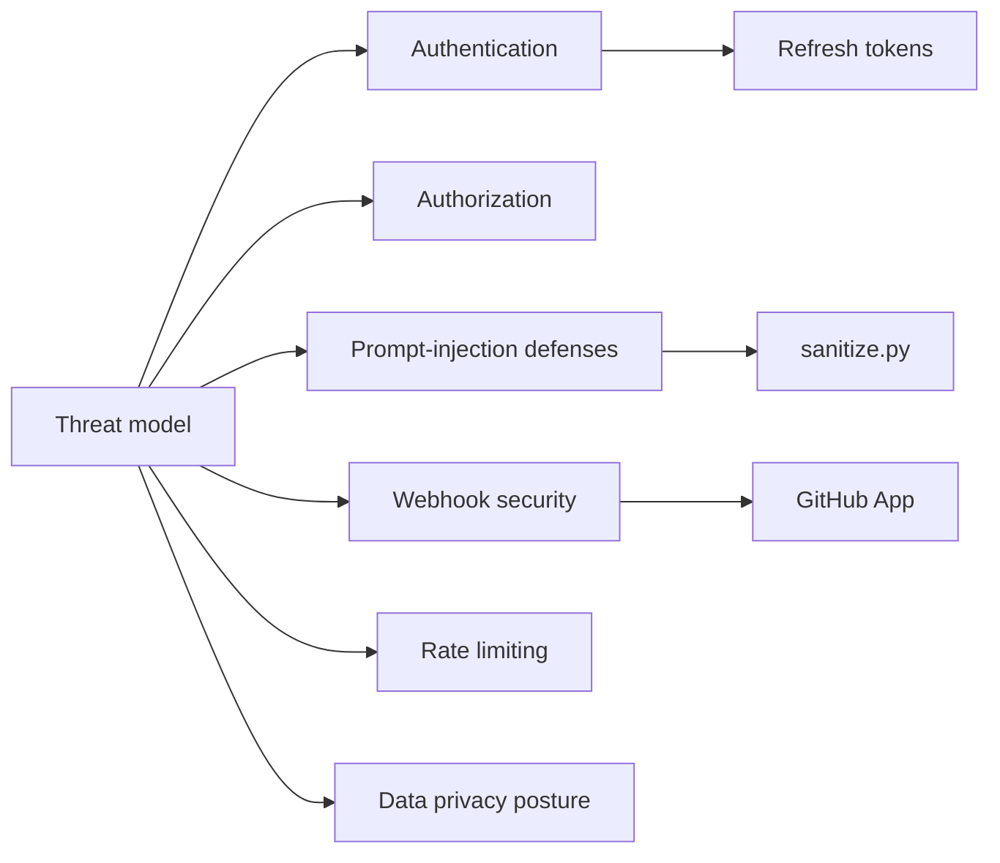

# `docs/security/`

Security model, threat analysis, privacy posture, and incident handling.

## Contents

| Doc | Audience | Purpose |
|-----|----------|---------|
| [`SECURITY_MODEL.md`](./SECURITY_MODEL.md) | Engineers + Security | Threat model, authn/z, refresh tokens, prompt-injection defenses, GitHub webhook security, rate limiting |
| [`SECURITY.md`](./SECURITY.md) | Operators + Users | Hardening checklist + reporting a vulnerability |
| [`INCIDENT_RUNBOOK.md`](./INCIDENT_RUNBOOK.md) | On-call | What to do when an alert fires |
| [`DATA_PRIVACY.md`](./DATA_PRIVACY.md) | Legal + Users | What we collect, retain, and share |

## Architecture

## Responsibilities

- Describe **what** is protected, **how**, and **against whom**.
- Be precise about what is *not* in scope.
- Be the single place where a security reviewer can understand AgentForge.

## Do Not Place Here

- Routine operational runbooks — those belong in `docs/deployment/` and the
  incident runbook already here.
- API contracts — `docs/api/API.md`.
- Architecture diagrams that aren't security-relevant — `docs/architecture/`.

## Related Modules

- Implementation: `apps/api/app/auth.py`, `agents/sanitize.py`,
  `apps/api/app/integrations/github.py`.
- Env vars: `docs/development/ENV.md`.
- Reporting vulnerabilities: see `SECURITY.md`.